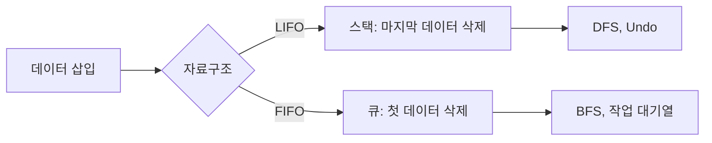

# 스택과 큐

- **스택(Stack)**: 후입선출(LIFO, Last In First Out) 구조로, 가장 최근에 들어온 데이터가 먼저 나온다.
- **큐(Queue)**: 선입선출(FIFO, First In First Out) 구조로, 먼저 들어온 데이터가 먼저 나온다.
- 두 자료구조 모두 삽입과 삭제 위치가 제한되며, 작업 순서 제어·탐색·운영체제 처리에 자주 사용된다.

## 개념 설명

스택은 한쪽 끝인 `top`에서만 삽입과 삭제가 일어난다. 접시를 쌓고 위에서부터 꺼내는 상황과 같다. 주요 연산은 `push`(삽입), `pop`(삭제), `peek` 또는 `top`(맨 위 확인)이다. 함수 호출 스택, 괄호 검사, 실행 취소(Undo), DFS(깊이 우선 탐색)에 활용된다.

큐는 한쪽에서 데이터를 넣고 반대쪽에서 꺼낸다. 줄을 선 사람 중 먼저 온 사람이 먼저 처리되는 상황과 같다. 주요 연산은 `enqueue`(삽입), `dequeue`(삭제), `front`(맨 앞 확인)이다. 작업 대기열, 프린터 출력, BFS(너비 우선 탐색), 서버 요청 처리에 사용된다.

일반적인 스택과 큐의 삽입·삭제는 `O(1)`이다. 단, 배열 기반 큐에서 앞 원소를 삭제할 때 모든 원소를 이동시키면 `O(n)`이 될 수 있다. 따라서 Python에서는 큐 구현에 리스트의 `pop(0)` 대신 `collections.deque`의 `popleft()`를 사용한다. 큐가 비었을 때 삭제하거나 스택의 빈 상태에서 `pop`하는 상황은 예외 처리가 필요하다.

## 코드 예제

```python
from collections import deque

stack = []
stack.append("A")          # push
stack.append("B")
print(stack.pop())         # B: LIFO

queue = deque()
queue.append("A")          # enqueue
queue.append("B")
print(queue.popleft())     # A: FIFO

# BFS 예시
graph = {"A": ["B", "C"], "B": [], "C": []}
q, visited = deque(["A"]), set()
while q:
    node = q.popleft()
    if node in visited:
        continue
    visited.add(node)
    q.extend(graph[node])
```

## 동작 흐름



## 면접 질문

### 1. 배열 기반 큐에서 `pop(0)`이 비효율적인 이유는?

삭제 후 남은 원소를 앞으로 이동해야 하므로 최악의 경우 `O(n)`이 걸린다. 연결 리스트나 원형 큐, Python의 `deque`를 사용하면 삭제를 `O(1)`에 처리할 수 있다.

### 2. DFS와 BFS는 각각 어떤 자료구조를 사용하는가?

DFS는 스택을 사용하며, 재귀 호출 스택으로 구현할 수도 있다. BFS는 큐를 사용해 가까운 정점부터 순서대로 탐색한다. 가중치가 없는 그래프에서 BFS는 시작점으로부터 최단 간선 수 경로를 찾는 데 유리하다.

> **한 줄 정리:** 스택은 최근 작업부터, 큐는 오래된 작업부터 처리하는 자료구조이며, 문제의 처리 순서가 선택 기준이다.
