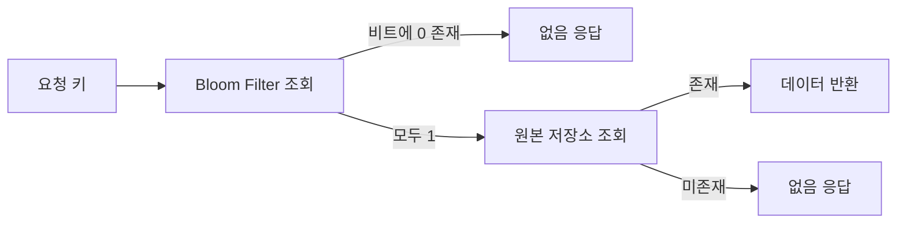

# Bloom Filter: 대규모 조회를 줄이는 확률적 자료구조

- **존재하지 않음은 확실히 판별**하지만, 존재한다고 판단한 결과는 오탐(false positive)일 수 있다.
- 비트 배열과 여러 해시 함수를 사용해 **메모리를 매우 적게 사용**한다.
- 캐시, 데이터베이스, 스팸 차단 등에서 불필요한 조회를 줄이는 용도로 효과적이다.

## 개념 설명

Bloom Filter는 어떤 값이 집합에 포함되어 있는지 빠르게 검사하는 자료구조다. 길이 `m`인 비트 배열을 0으로 초기화하고, `k`개의 해시 함수가 반환한 위치를 1로 설정한다.

값을 추가할 때는 해시 결과에 해당하는 여러 비트를 1로 만든다. 조회할 때 하나라도 0이면 해당 값은 **반드시 존재하지 않는다**. 모든 비트가 1이면 존재할 가능성이 있지만, 다른 값들이 같은 위치를 설정했을 수 있어 오탐이 발생한다.

반대로 이미 1인 비트를 되돌릴 수 없으므로 일반 Bloom Filter는 값을 삭제할 수 없다. 삭제가 필요하면 카운팅 Bloom Filter처럼 비트 대신 카운터를 사용한다. 데이터 개수와 허용 오탐률을 기준으로 배열 크기와 해시 개수를 정해야 하며, 오탐률은 메모리 사용량과 트레이드오프 관계다.

현업에서는 Redis나 Cassandra 같은 저장소에 요청하기 전에 Bloom Filter를 둔다. 예를 들어 존재하지 않는 사용자 ID, 상품 ID, URL을 데이터베이스까지 조회하지 않아도 되므로 디스크 I/O와 네트워크 비용을 줄일 수 있다. CDN 캐시 미스 폭주 방지, 악성 URL·이메일 차단, 중복 이벤트 필터링에도 활용된다. 다만 오탐을 허용할 수 없는 인증·결제 판단의 최종 근거로 사용하면 안 되며, 최종 확인은 원본 저장소에서 수행해야 한다.

```python
class BloomFilter:
    def __init__(self, size=1000):
        self.bits = [0] * size
        self.size = size

    def _indexes(self, value):
        return [hash(value) % self.size,
                hash("salt:" + value) % self.size]

    def add(self, value):
        for i in self._indexes(value):
            self.bits[i] = 1

    def might_contain(self, value):
        return all(self.bits[i] for i in self._indexes(value))
```

## 동작 흐름



## 면접 질문

### Q1. Bloom Filter에서 false positive는 발생하지만 false negative는 발생하지 않는 이유는?

값을 추가할 때 비트를 1로만 변경하기 때문이다. 조회 시 비트가 하나라도 0이면 해당 값이 추가된 적이 없다고 확정할 수 있지만, 모든 비트가 1인 경우에는 다른 값과 충돌했을 가능성이 있다.

### Q2. Bloom Filter를 사용하면 안 되는 상황은?

오탐이 업무적으로 허용되지 않는 경우다. 예를 들어 결제 승인이나 권한 검증의 최종 판단에 사용하면 안 된다. Bloom Filter는 후보를 줄이는 전처리 계층으로 사용하고, 최종 결과는 원본 저장소에서 검증해야 한다.

> **한 줄 정리:** Bloom Filter는 약간의 오탐을 대가로 대규모 저장소 조회와 메모리 비용을 크게 줄이는 자료구조다.
