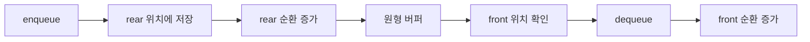

# 스택과 큐: 내부 구현 관점

- **스택(Stack)**: 후입선출(LIFO) 구조이며, 배열의 끝을 `top`으로 사용하면 삽입·삭제가 평균 `O(1)`이다.
- **큐(Queue)**: 선입선출(FIFO) 구조이며, 배열에서는 원형 버퍼를 사용해야 앞쪽 빈 공간을 재사용할 수 있다.
- 핵심 성능은 자료구조 자체보다 **인덱스 관리, 메모리 재할당, 캐시 지역성, 동시성 제어**에 의해 달라진다.

## 개념 설명

스택은 가장 최근에 들어온 원소를 먼저 꺼낸다. 배열 기반 구현에서는 `top`을 다음 삽입 위치 또는 현재 마지막 원소 위치로 정의한다. `push`는 `data[top]`에 저장한 뒤 `top`을 증가시키고, `pop`은 `top`을 감소시킨 후 값을 반환한다. 용량이 가득 차면 더 큰 배열을 할당하고 복사하는 동적 배열 방식이 일반적이다. 이때 개별 확장은 `O(n)`이지만, 보통 용량을 두 배로 늘려 삽입 전체의 **분할 상환 시간**을 `O(1)`로 만든다.

큐는 먼저 들어온 원소를 먼저 꺼낸다. 단순 배열에서 `dequeue`마다 모든 원소를 한 칸씩 이동하면 `O(n)`이므로 비효율적이다. 대신 `front`와 `rear` 인덱스를 두고, 제거된 앞쪽 공간을 다시 사용하는 **원형 큐**를 구현한다. 인덱스는 `(index + 1) % capacity`로 순환한다. 배열 기반 큐는 연속 메모리를 사용하므로 연결 리스트보다 캐시 지역성이 좋지만, 크기 확장 시 복사가 필요하다. 연결 리스트 큐는 노드와 포인터를 사용해 양 끝 연산이 `O(1)`이나, 노드별 메모리 할당과 포인터 추적 비용이 발생한다.

스택은 함수 호출 프레임, 괄호 검사, DFS에 적합하고 큐는 작업 스케줄링, BFS, 메시지 버퍼에 적합하다. 멀티스레드 환경에서는 단순 구현만으로 안전하지 않으므로 락, 원자 연산, 블로킹 큐 등을 추가해야 한다.

## 코드 예시

```python
class CircularQueue:
    def __init__(self, capacity):
        self.a = [None] * capacity
        self.front = self.rear = self.size = 0
    def enqueue(self, x):
        if self.size == len(self.a): raise OverflowError()
        self.a[self.rear] = x
        self.rear = (self.rear + 1) % len(self.a)
        self.size += 1
    def dequeue(self):
        if self.size == 0: raise IndexError()
        x = self.a[self.front]
        self.front = (self.front + 1) % len(self.a)
        self.size -= 1
        return x
```

## 동작 흐름



## 면접 질문

1. **배열 큐에서 앞 원소를 삭제할 때 원소를 이동시키면 왜 느린가?**  
   매번 최대 `n`개의 원소를 이동하므로 `dequeue`가 `O(n)`이 된다. `front` 인덱스나 원형 버퍼를 사용하면 `O(1)`로 개선할 수 있다.

2. **스택의 동적 배열 확장 비용을 어떻게 설명하는가?**  
   확장 순간에는 기존 원소 복사로 `O(n)`이지만, 용량을 일정 배수로 키우면 여러 삽입에 비용이 분산되어 삽입의 분할 상환 시간은 `O(1)`이다.

> **한 줄 정리:** 스택은 `top`, 큐는 `front·rear` 인덱스를 정교하게 관리하는 것이 내부 구현과 성능의 핵심이다.
