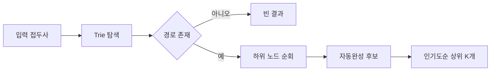

# Trie(트라이): 문자열 검색과 자동완성의 핵심 자료구조

- 문자열을 문자 단위 경로로 저장해 **접두사 검색(prefix search)** 을 빠르게 처리한다.
- 자동완성, 사전 검색, 라우팅, 금칙어 필터처럼 **문자열의 시작 부분이 중요한 기능**에 적합하다.
- 해시 테이블보다 접두사 질의에 강하지만, 노드와 자식 포인터 때문에 **메모리 사용량이 크다**.

## 개념 설명

Trie는 각 문자열을 루트에서 시작하는 문자 경로로 표현한다. 예를 들어 `car`, `cat`을 저장하면 `c → a`까지 경로를 공유하고, 이후 `r`, `t`로 분기한다. 각 노드는 자식 문자와 단어 종료 여부를 가진다.

문자열 길이를 `L`이라 할 때 삽입과 정확한 검색은 평균적으로 `O(L)`이다. 전체 단어 수 `N`에 비례하지 않고 입력 길이에 비례하므로, 검색어가 길어질수록 유리하다. `ca` 같은 접두사를 찾은 뒤 하위 노드를 순회하면 자동완성 후보를 얻을 수 있다.

현업에서는 검색창 자동완성, 커맨드 팔레트, 상품명·주소 검색, 전화번호나 도메인 접두사 검색에 활용된다. 웹 라우터에서도 경로 세그먼트를 Trie에 저장해 정적 경로와 동적 경로를 효율적으로 매칭할 수 있다. 또한 금칙어 필터는 모든 금칙어를 Trie에 넣고 문장을 왼쪽부터 탐색해 부분 문자열을 검사한다.

다만 일반적인 정확한 조회만 필요하면 `HashMap`이 더 단순하고 메모리 효율적일 수 있다. 자식 노드를 객체 Map으로 두면 구현은 쉽지만 오버헤드가 커진다. 대규모 서비스에서는 배열 대신 압축된 해시 구조, Radix Trie(공간 압축 Trie), Double-Array Trie를 고려한다. 자동완성 결과가 많다면 단어 빈도나 인기도를 각 노드에 저장하고, 상위 K개 결과를 미리 캐시하면 응답 시간을 줄일 수 있다. 입력 정규화, 유니코드, 대소문자 정책도 반드시 정의해야 한다.

## 코드 예시: 접두사 삽입과 검색

```javascript
class Trie {
  constructor() { this.root = { next: new Map(), end: false }; }
  insert(word) {
    let node = this.root;
    for (const ch of word) {
      if (!node.next.has(ch)) node.next.set(ch, { next: new Map(), end: false });
      node = node.next.get(ch);
    }
    node.end = true;
  }
  has(word) {
    let node = this.root;
    for (const ch of word) {
      node = node.next.get(ch);
      if (!node) return false;
    }
    return node.end;
  }
}
```

## 동작 흐름



## 면접 질문

### 1. Trie와 HashMap의 차이는 무엇인가?

HashMap은 완전한 키의 평균 `O(1)` 조회에 강하고, Trie는 문자열 길이 `L`에 따른 `O(L)` 조회와 접두사 검색에 강하다. 대신 Trie는 공유되지 않는 문자 경로와 자식 포인터로 메모리를 더 사용한다.

### 2. Trie의 메모리 사용량을 줄이는 방법은?

공통 접두사를 공유하고, 단일 자식 경로를 합치는 Radix Trie를 사용한다. 자식 저장 구조를 배열에서 압축 Map 또는 정수 인덱스 기반 배열로 바꾸고, 대규모 읽기 전용 데이터에는 Double-Array Trie를 적용할 수 있다.

> **한 줄 정리:** Trie는 접두사 기반 기능을 빠르게 만들지만, 운영 환경에서는 메모리·문자 정규화·상위 결과 캐시까지 함께 설계해야 한다.
