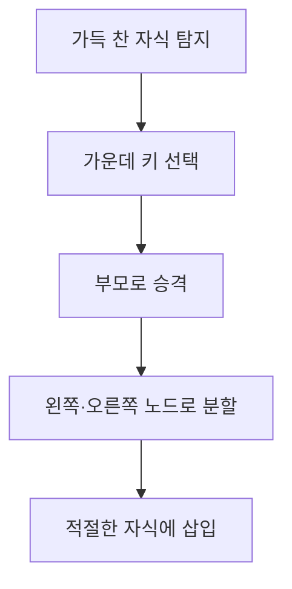

# B-Tree: 디스크 친화적 균형 탐색 트리

- 노드 하나에 여러 키와 자식 포인터를 저장해 트리 높이를 낮춘다.
- 모든 리프가 같은 깊이에 있으며, 삽입·삭제 후에도 균형을 유지한다.
- 데이터베이스 인덱스에서는 보통 리프에 실제 레코드 위치를 모으는 B+Tree 형태를 사용한다.

## 개념 설명

B-Tree는 노드 하나가 여러 키를 가지는 다진 탐색 트리다. 차수 `m`인 노드는 최대 `m-1`개의 키와 `m`개의 자식을 가진다. 구현에서는 차수보다 최소 차수 `t`를 자주 사용하며, 루트가 아닌 노드는 보통 최소 `t-1`, 최대 `2t-1`개의 키를 보관한다. 키는 정렬된 배열로 저장하고, 자식 포인터는 키보다 하나 많게 둔다.

탐색 시 노드 내부에서 이진 탐색으로 이동할 자식 위치를 찾는다. 한 노드가 디스크 페이지 크기만큼 많은 키를 담으면 트리 높이가 작아져 디스크 I/O 횟수가 감소한다. 따라서 시간 복잡도는 `O(log N)`이며, 실제 성능은 CPU 비교 횟수보다 페이지 접근 횟수의 영향을 크게 받는다.

삽입은 리프에 키를 넣는 방식이다. 노드가 가득 차면 가운데 키를 부모로 올리고, 나머지 키를 두 노드로 분할한다. 루트가 분할되면 새 루트가 생성되어 높이가 1 증가한다. 구현은 삽입 전에 가득 찬 자식 노드를 미리 분할하는 방식이 흔하다.

삭제는 더 복잡하다. 삭제 대상이 내부 노드에 있으면 선행자 또는 후속자 키로 대체한 뒤 리프에서 삭제한다. 삭제 후 키 수가 최소 조건보다 작아지면 형제에서 빌리거나, 형제와 병합한다. 데이터베이스 구현에서는 페이지 내부 슬롯 배열, 키 압축, 페이지 분할 로그, 래치 결합으로 동시성까지 고려한다. B-Tree와 달리 B+Tree는 내부 노드에 탐색 키만 두고 실제 레코드 포인터를 리프에 저장하며, 리프를 연결해 범위 검색을 빠르게 처리한다.

## 코드 예시

```python
def insert_nonfull(node, key):
    i = len(node.keys) - 1
    if node.leaf:
        node.keys.append(None)
        while i >= 0 and key < node.keys[i]:
            node.keys[i + 1] = node.keys[i]
            i -= 1
        node.keys[i + 1] = key
    else:
        while i >= 0 and key < node.keys[i]:
            i -= 1
        i += 1
        if len(node.child[i].keys) == 2 * T - 1:
            split_child(node, i)
            if key > node.keys[i]:
                i += 1
        insert_nonfull(node.child[i], key)
```

## 구조와 삽입 흐름



## 면접 질문

### 1. B-Tree가 이진 탐색 트리보다 디스크에서 유리한 이유는?

노드 하나가 여러 키를 저장하므로 트리 높이가 낮다. 한 번의 디스크 페이지 읽기로 많은 키를 얻어 랜덤 I/O 횟수를 줄일 수 있다.

### 2. B-Tree 삽입에서 분할 시 가운데 키를 부모로 올리는 이유는?

왼쪽과 오른쪽 키 범위를 균등하게 나누고, 부모가 두 구간을 구분하도록 하기 위해서다. 이를 통해 각 노드의 최소 키 수와 정렬 불변식을 유지한다.

## 한 줄 정리

B-Tree는 정렬된 다수의 키를 페이지 단위로 관리해 디스크 I/O를 줄이는 균형 다진 탐색 트리다.
