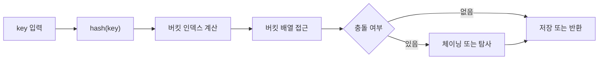

# 해시 테이블(Hash Table)의 내부 구현

- **핵심 구조:** 해시 함수로 키를 배열 인덱스로 변환하고, 해당 버킷에 값을 저장한다.
- **충돌 처리:** 서로 다른 키가 같은 인덱스를 만들 수 있으므로 체이닝이나 개방 주소법을 사용한다.
- **성능 관리:** 로드 팩터가 커지면 리사이징하며, 평균적으로 삽입·검색·삭제가 `O(1)`이다.

## 개념 설명

해시 테이블은 내부적으로 **버킷 배열**을 가진다. 키 `key`가 들어오면 해시 함수 `hash(key)`를 계산한 뒤, 보통 `hash(key) % capacity`로 배열 위치를 결정한다. 배열 크기가 8이고 해시값이 19라면 인덱스는 `3`이다. 실제 구현에서는 음수 해시를 방지하기 위해 비트 마스크나 안전한 나머지 연산을 사용한다.

서로 다른 키가 같은 인덱스를 얻는 현상을 **충돌**이라고 한다. 가장 단순한 해결법은 **체이닝**이다. 각 버킷에 연결 리스트나 동적 배열을 두고, 같은 위치에 여러 엔트리를 저장한다. 검색 시 해당 버킷만 순회하며 키를 다시 비교한다. 따라서 해시값이 같아도 키 비교가 반드시 필요하다.

**개방 주소법**은 모든 엔트리를 배열 내부에 저장한다. 충돌하면 선형 탐사(`i+1`), 제곱 탐사, 이중 해싱 등으로 다음 위치를 찾는다. 캐시 지역성이 좋아 빠를 수 있지만, 삭제한 칸을 단순히 비우면 탐색 경로가 끊어진다. 그래서 삭제 위치를 `TOMBSTONE`으로 표시하거나 클러스터를 재배치한다.

성능은 **로드 팩터** `α = 저장된 원소 수 / 버킷 수`의 영향을 크게 받는다. 체이닝에서는 `α`가 커질수록 한 버킷의 평균 길이가 길어지고, 개방 주소법에서는 빈 슬롯이 줄어 충돌이 급증한다. 임계치를 넘으면 더 큰 배열을 만들고 모든 엔트리를 새 해시 위치에 다시 넣는다. 이를 **리해싱(resizing)**이라 하며, 한 번의 비용은 `O(n)`이지만 삽입 전체의 분할 상환 비용은 평균 `O(1)`이다.

최악의 경우 모든 키가 한 버킷에 몰려 `O(n)`이 된다. 따라서 균등한 해시 함수, 키의 불변성, 적절한 초기 용량이 중요하다. 실무에서는 해시 공격을 막기 위해 무작위 시드나 트리 구조로 버킷을 보강하기도 한다.

```python
class HashTable:
    def __init__(self, capacity=8):
        self.buckets = [[] for _ in range(capacity)]

    def _bucket(self, key):
        return self.buckets[hash(key) % len(self.buckets)]

    def put(self, key, value):
        bucket = self._bucket(key)
        for i, (k, _) in enumerate(bucket):
            if k == key:
                bucket[i] = (key, value)
                return
        bucket.append((key, value))

    def get(self, key):
        for k, v in self._bucket(key):
            if k == key:
                return v
        raise KeyError(key)
```



## 면접 질문

### 1. 해시 테이블의 평균 시간 복잡도가 `O(1)`인 이유는?

해시 함수가 키를 버킷에 균등하게 분산시키고, 로드 팩터를 적절히 유지한다는 가정 때문이다. 충돌이 적으면 특정 버킷에서 확인할 엔트리 수가 상수에 가깝다. 단, 충돌이 집중되면 최악의 경우 `O(n)`이다.

### 2. 개방 주소법에서 삭제를 바로 빈 칸으로 만들면 안 되는 이유는?

탐색은 빈 칸을 만나면 해당 키가 없다고 판단할 수 있다. 삭제된 엔트리 뒤에 있던 키를 찾지 못하게 되므로 `TOMBSTONE`을 사용하거나 탐색 클러스터를 재구성해야 한다.

> **한 줄 정리:** 해시 테이블은 `해시 함수 + 버킷 배열 + 충돌 처리 + 리사이징`으로 평균 `O(1)` 접근을 구현한다.
