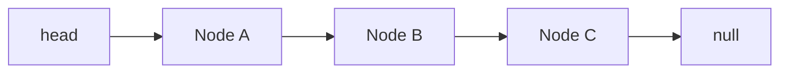

# 연결 리스트(Linked List)

## 핵심 3가지

- 노드가 데이터와 다음 노드의 참조를 가지며, 메모리상 연속되지 않아도 순서를 표현한다.
- 인덱스 접근은 `O(n)`이지만, 삽입·삭제할 노드를 이미 알고 있으면 참조 변경만으로 `O(1)`에 처리할 수 있다.
- 가장 흔한 버그는 `head` 갱신 누락, `next` 유실, `null` 처리 누락이며, 경계 조건을 먼저 정의해야 한다.

## 개념 설명

연결 리스트는 `data`와 `next`를 가진 노드들의 연결 구조다. 단일 연결 리스트는 다음 방향으로만 이동하고, 이중 연결 리스트는 `prev`와 `next`를 모두 가진다. 배열처럼 연속된 메모리를 요구하지 않으므로 중간 삽입·삭제에 유리하지만, 원하는 위치를 찾으려면 처음부터 순회해야 한다.

시간 복잡도는 탐색·인덱스 접근이 `O(n)`, 맨 앞 삽입·삭제가 `O(1)`이다. 꼬리 삽입은 `tail` 포인터를 유지하면 `O(1)`이고, 유지하지 않으면 마지막까지 순회해 `O(n)`이다. 따라서 “삭제가 빠르다”는 표현은 삭제할 노드 또는 그 이전 노드를 이미 알고 있을 때만 정확하다.

자주 하는 실수는 다음과 같다.

- 첫 노드를 삭제하면서 `head`를 새 노드로 바꾸지 않는다.
- `current.next = current.next.next` 전에 기존 `next`를 잃어버려 연결이 끊긴다.
- 빈 리스트, 원소가 하나뿐인 리스트, 마지막 노드 삭제를 고려하지 않는다.
- `tail`과 `size`를 저장하면서 삽입·삭제 시 함께 갱신하지 않는다.
- 순회 중 현재 노드를 삭제한 뒤 `current = current.next`를 수행해 노드를 건너뛴다.
- 종료 조건을 잘못 작성해 `null` 역참조나 무한 루프가 발생한다.

안티패턴은 배열이 더 적합한 상황에서 연결 리스트를 습관적으로 사용하는 것이다. 빈번한 인덱스 접근, 캐시 효율, 메모리 사용량이 중요하면 배열이나 동적 배열이 보통 낫다. 또한 외부에 내부 노드 참조를 과도하게 노출하면 리스트 불변식이 깨지므로, 삽입·삭제 API를 통해 상태를 통제하는 편이 안전하다.

## 코드 예시

```ts
type Node = { value: number; next: Node | null };

function remove(head: Node | null, value: number): Node | null {
  const dummy: Node = { value: 0, next: head };
  let prev = dummy;
  while (prev.next !== null) {
    if (prev.next.value === value) {
      prev.next = prev.next.next;
      break;
    }
    prev = prev.next;
  }
  return dummy.next;
}
```

`dummy` 노드를 사용하면 첫 노드 삭제와 중간 노드 삭제를 같은 로직으로 처리할 수 있다. 실무에서는 삭제 대상이 없을 때의 정책, 중복 값 처리, `tail`·`size` 갱신 여부도 명확히 해야 한다.



## 면접 질문

1. **연결 리스트에서 인덱스 접근이 느린 이유는?**  
   노드 주소를 계산할 수 없으므로 `head`부터 순차적으로 이동해야 하며 `O(n)`이 걸린다.

2. **단일 연결 리스트에서 특정 노드를 `O(1)`에 삭제할 수 있는가?**  
   노드의 이전 노드 참조가 없으면 일반적으로 어렵다. 이전 노드를 알고 있거나, 마지막 노드가 아니라면 현재 노드에 다음 값을 복사하는 변형이 가능하다.

## 한 줄 정리

연결 리스트는 참조 변경에는 강하지만 탐색과 캐시 효율에는 약하므로, 경계 조건과 포인터 불변식을 우선 설계하라.
