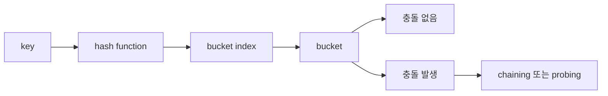

# 해시 테이블(Hash Table)

- **평균 `O(1)`**에 키로 값을 조회·삽입·삭제할 수 있지만, 충돌이 많으면 최악 `O(n)`이 된다.
- 핵심 요소는 **해시 함수, 버킷 배열, 충돌 해결 전략, 리사이징**이다.
- 면접에서는 평균/최악 시간 복잡도, 충돌 처리, 로드 팩터, `HashMap`과 `TreeMap` 차이를 자주 묻는다.

## 개념 설명

해시 테이블은 키를 해시 함수에 넣어 얻은 정수 값을 배열의 인덱스로 변환하고, 해당 버킷에 키-값 쌍을 저장하는 자료구조다. 예를 들어 `index = hash(key) % capacity`와 같이 위치를 계산한다. 해시 함수는 같은 키에 대해 항상 같은 값을 반환해야 하며, 서로 다른 키가 가능한 한 고르게 분산되도록 설계해야 한다.

서로 다른 키가 같은 버킷에 매핑되는 현상을 **충돌(collision)**이라고 한다. 대표적인 해결 방법은 두 가지다. **체이닝**은 각 버킷에 연결 리스트나 동적 배열을 두어 여러 항목을 저장한다. 구현이 비교적 쉽고 삭제가 편하지만, 최악의 경우 한 버킷에 데이터가 몰려 `O(n)`이 된다. **개방 주소법**은 충돌 시 다른 빈 버킷을 탐색한다. 선형 탐사, 제곱 탐사, 이중 해싱 등이 있으며 캐시 효율이 좋지만 삭제 처리가 까다롭다.

**로드 팩터(load factor)**는 저장된 원소 수를 버킷 수로 나눈 값이다. 값이 커질수록 충돌 확률이 증가하므로 임계치를 넘으면 버킷 배열을 키우고 모든 원소를 새 해시 위치에 다시 배치한다. 이를 **리해싱(rehashing)**이라 한다. 따라서 리사이징이 발생하는 순간은 `O(n)`이지만, 분할 상환하면 삽입의 평균 비용은 `O(1)`로 볼 수 있다.

키는 해시뿐 아니라 동등성 비교도 만족해야 한다. 즉, `a.equals(b)`가 참이면 `a.hashCode() == b.hashCode()`여야 한다. 반대로 해시값이 같다고 두 키가 같은 것은 아니다. 가변 객체를 키로 사용하면 저장 후 해시값이 바뀌어 조회가 실패할 수 있으므로 주의해야 한다.

```java
Map<String, Integer> map = new HashMap<>();
map.put("A", 10);
map.put("B", 20);

int value = map.getOrDefault("A", 0);
map.remove("B");
boolean exists = map.containsKey("A");
```



## 면접 질문

### 1. 해시 테이블의 평균 시간 복잡도와 최악 시간 복잡도는?

평균적으로 조회·삽입·삭제는 `O(1)`이다. 하지만 해시 충돌로 모든 원소가 한 버킷에 모이면 최악 `O(n)`이다. 균형 잡힌 트리를 충돌 저장에 사용하면 최악을 `O(log n)`까지 낮출 수 있다.

### 2. `HashMap`과 `TreeMap`의 차이는?

`HashMap`은 해시 기반이라 평균 `O(1)`이며 순서를 보장하지 않는다. `TreeMap`은 균형 이진 탐색 트리 기반이라 연산이 `O(log n)`이지만 키의 정렬 순서를 유지하고 범위 검색에 유리하다.

## 한 줄 정리

해시 테이블은 빠른 키 기반 검색을 제공하지만, 성능은 해시 함수·충돌 처리·로드 팩터 관리에 달려 있다.
