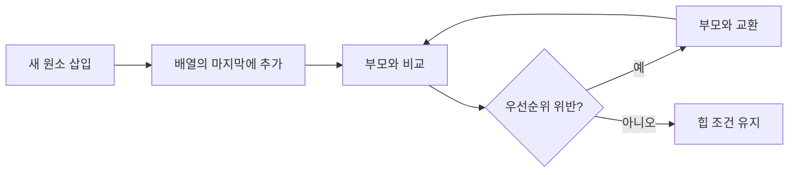

# 힙과 우선순위 큐: 자주 하는 실수와 안티패턴

- **힙(Heap)**은 완전 이진 트리 구조에서 부모와 자식의 우선순위 관계를 유지하는 자료구조다.
- **우선순위 큐(Priority Queue)**는 가장 높은 우선순위의 원소를 먼저 꺼내는 추상 자료형이며, 힙은 대표적인 구현 방법이다.
- 삽입과 최솟값·최댓값 확인은 효율적이지만, **임의 원소 탐색과 삭제는 빠르지 않다**는 한계를 반드시 기억해야 한다.

## 개념 설명

최소 힙에서는 모든 부모가 자식보다 작거나 같고, 최대 힙에서는 반대 관계를 유지한다. 완전 이진 트리이므로 배열로 저장할 수 있다. 0-based 배열에서 인덱스 `i`의 왼쪽 자식은 `2i+1`, 오른쪽 자식은 `2i+2`, 부모는 `(i-1)//2`다.

삽입은 마지막 위치에 넣은 뒤 부모와 비교하며 위로 올리는 **sift-up**을 수행한다. 삭제는 보통 루트 원소를 제거하고 마지막 원소를 루트로 옮긴 뒤 아래로 내리는 **sift-down**을 수행한다. 두 연산 모두 `O(log N)`이며, 루트 확인은 `O(1)`이다. 배열 전체를 힙으로 만드는 heapify는 `O(N)`이다.

가장 흔한 실수는 힙을 정렬된 배열로 오해하는 것이다. 힙은 루트의 우선순위만 보장하며, 형제 노드나 같은 깊이의 원소까지 정렬하지 않는다. 따라서 전체 정렬이 필요하면 힙 정렬이나 별도의 정렬 알고리즘을 사용해야 한다.

또 다른 안티패턴은 우선순위가 바뀐 객체를 힙 내부에서 직접 수정하는 것이다. 힙은 변경 사실을 자동으로 감지하지 않으므로 잘못된 원소가 먼저 나올 수 있다. 우선순위 변경이 필요하면 삭제 후 재삽입하거나, 새 항목을 넣고 기존 항목을 무효화하는 방식을 사용한다.

비교 함수에서 `a-b`처럼 정수 뺄셈으로 비교하면 오버플로가 발생할 수 있다. `a < b`, `a > b`를 명시적으로 비교하는 편이 안전하다. 또한 빈 큐에서 `pop`하는 경우, 동률 우선순위의 처리 기준, 최대 힙을 위한 부호 반전 여부를 명확히 해야 한다.

## 코드 예시

```python
import heapq

pq = []
heapq.heappush(pq, (2, "작업 B"))
heapq.heappush(pq, (1, "작업 A"))
heapq.heappush(pq, (1, "작업 C"))

while pq:
    priority, task = heapq.heappop(pq)
    print(priority, task)  # 동률이면 task가 두 번째 기준
```

## 동작 흐름



## 면접 질문

### 1. 힙에서 최솟값 삭제가 `O(log N)`인 이유는?

루트 삭제 후 마지막 원소를 루트로 이동하고, 한 경로를 따라 sift-down만 수행하기 때문이다. 힙의 높이가 `O(log N)`이므로 연산도 `O(log N)`이다.

### 2. 힙과 이진 탐색 트리의 차이는?

힙은 루트의 최솟값·최댓값 확인에 강하지만 전체 탐색에는 부적합하다. 이진 탐색 트리는 균형이 유지되면 탐색·삽입·삭제가 `O(log N)`이며 정렬된 순회가 가능하다.

> **한 줄 요약:** 힙은 전체 정렬 구조가 아니라, 최우선 원소를 빠르게 꺼내기 위한 구조이며 비교 기준과 우선순위 변경을 특히 조심해야 한다.
