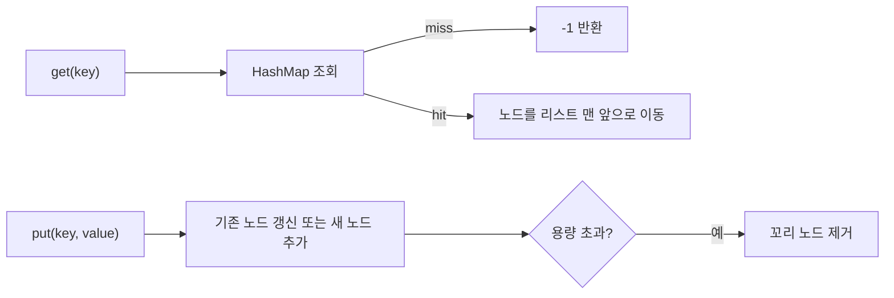

# LRU 캐시

- **LRU(Least Recently Used)**: 가장 오래 사용되지 않은 데이터를 우선 제거하는 캐시 정책
- **핵심 자료구조**: `HashMap`으로 조회하고, 이중 연결 리스트로 사용 순서를 관리
- **시간 복잡도**: 조회, 삽입, 갱신, 삭제, 만료 처리를 모두 평균 `O(1)`로 구현 가능

## 개념 설명

LRU 캐시는 제한된 용량 안에서 최근에 사용한 데이터를 오래 유지한다. 캐시가 가득 찬 상태에서 새 데이터를 넣으면, 가장 오랫동안 접근되지 않은 항목을 제거한다. 웹 브라우저 캐시, 데이터베이스 버퍼, 운영체제 페이지 교체, 메모이제이션 등에 활용된다.

구현 시 자료구조를 하나만 사용하면 문제가 생긴다. 배열이나 리스트만 사용하면 특정 키를 찾는 데 `O(n)`이 걸리고, `HashMap`만 사용하면 항목의 사용 순서를 효율적으로 갱신하기 어렵다. 따라서 두 자료구조를 결합한다.

- `HashMap<Key, Node>`: 키로 노드를 평균 `O(1)`에 탐색
- 이중 연결 리스트: 노드 이동과 삭제를 `O(1)`에 수행
- 리스트의 앞: 가장 최근에 사용된 항목
- 리스트의 뒤: 가장 오래된 항목

`get(key)`이 성공하면 해당 노드를 리스트 맨 앞으로 이동한다. `put(key, value)`에서 기존 키라면 값을 갱신하고 앞으로 이동한다. 새 키를 추가한 뒤 용량을 초과하면 꼬리 노드를 제거하고 `HashMap`에서도 삭제한다. 실제 구현에서는 경계 조건을 단순화하기 위해 더미 헤드와 더미 테일을 자주 사용한다.

캐시 적중률은 용량과 데이터 접근 패턴에 따라 달라진다. LRU는 최근 접근성이 미래 접근성을 어느 정도 예측한다는 지역성에 기반하지만, 순환 접근처럼 캐시 용량보다 큰 데이터 집합을 반복해서 읽는 패턴에서는 적중률이 낮아질 수 있다. 멀티스레드 환경에서는 `HashMap`과 리스트 변경을 하나의 원자적 작업처럼 보호해야 한다.

```python
from collections import OrderedDict

class LRUCache:
    def __init__(self, capacity):
        self.cap = capacity
        self.data = OrderedDict()

    def get(self, key):
        if key not in self.data:
            return -1
        self.data.move_to_end(key)
        return self.data[key]

    def put(self, key, value):
        if key in self.data:
            self.data.move_to_end(key)
        self.data[key] = value
        if len(self.data) > self.cap:
            self.data.popitem(last=False)
```



## 면접 질문

### 1. LRU 캐시를 `O(1)` 시간에 구현하려면 어떤 자료구조가 필요한가?

`HashMap`과 이중 연결 리스트가 필요하다. `HashMap`은 키로 노드를 빠르게 찾고, 리스트는 노드의 순서 변경과 가장 오래된 항목 제거를 `O(1)`에 처리한다.

### 2. `HashMap`만으로 LRU 캐시를 구현하기 어려운 이유는 무엇인가?

키 조회는 빠르지만 사용 순서를 관리하기 어렵다. 별도로 순서를 저장하면 항목 이동이나 가장 오래된 항목 삭제에 `O(n)`이 걸릴 수 있어 LRU의 목표인 평균 `O(1)` 연산을 만족하기 어렵다.

> **한 줄 정리:** LRU 캐시는 `HashMap`의 빠른 조회와 이중 연결 리스트의 순서 관리를 결합해 모든 핵심 연산을 평균 `O(1)`로 만든다.
