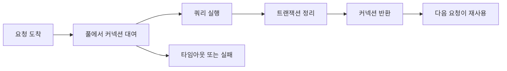

# 커넥션 풀링(Connection Pooling)

- DB 커넥션을 요청마다 새로 만들지 않고, 미리 생성한 커넥션을 재사용한다.
- 핵심은 **풀 크기**, **대여 후 반드시 반환**, **대기 시간과 타임아웃 관리**다.
- 성능 최적화보다 먼저 커넥션 누수, 트랜잭션 오염, 과도한 풀 크기를 방지해야 한다.

## 개념 설명

DB 커넥션 생성은 TCP 연결, 인증, 세션 초기화 등 비용이 크다. 커넥션 풀은 애플리케이션 시작 시 일부 커넥션을 만들고, 요청이 오면 유휴 커넥션을 대여한다. 작업이 끝나면 물리적으로 닫지 않고 풀에 반환하여 다음 요청이 재사용한다.

요청 수가 많을 때 매번 연결과 종료를 반복하는 비용을 줄이고, 동시에 사용할 수 있는 DB 연결 수를 제한하는 효과가 있다. 다만 풀은 DB의 최대 연결 수를 초과하지 않도록 설정해야 한다. 여러 애플리케이션 인스턴스가 있다면 `인스턴스 수 × 인스턴스별 풀 크기`가 실제 DB 연결 수가 된다.

### 자주 하는 실수와 안티패턴

- **요청마다 새 풀 생성**: 풀의 재사용 이점이 사라지고 연결 폭증이 발생한다. 프로세스당 하나의 풀을 공유한다.
- **대여 후 반환 누락**: 예외가 발생해도 `finally` 또는 라이브러리의 안전한 래퍼로 반환해야 한다. 누수되면 결국 모든 요청이 대기한다.
- **풀 크기를 무조건 크게 설정**: DB CPU와 메모리를 고갈시키고 오히려 쿼리 경쟁이 심해진다. 부하 테스트로 적정치를 찾는다.
- **반환 전에 트랜잭션 상태를 정리하지 않음**: `ROLLBACK`, 세션 변수, 격리 수준, 임시 테이블 등이 다음 요청에 남을 수 있다.
- **커넥션을 오래 점유**: 커넥션을 잡은 채 외부 API 호출, 파일 처리, 긴 계산을 수행하지 않는다. DB 작업 직전에 대여하고 즉시 반환한다.
- **타임아웃과 관측성 부족**: 대기 타임아웃, 유휴 시간, 사용 중인 커넥션 수, 누수 로그를 설정해야 장애 원인을 찾을 수 있다.
- **읽기와 쓰기 부하를 같은 풀로 처리**: 필요하다면 읽기 전용 풀과 쓰기 풀을 분리하되, 각각의 총 연결 수를 함께 계산한다.

## 코드 예시

```js
const pool = new Pool({ max: 10, connectionTimeoutMillis: 3000 });

async function findUser(id) {
  const client = await pool.connect();
  try {
    const { rows } = await client.query(
      'SELECT * FROM users WHERE id = $1', [id]
    );
    return rows[0];
  } finally {
    client.release(); // 성공·실패와 무관하게 반환
  }
}
```

## 처리 흐름



## 면접 질문

### 1. 커넥션 풀 크기를 크게 설정하면 항상 성능이 좋아지나요?

아니다. DB의 최대 연결 수를 초과하거나 CPU·메모리 경쟁이 증가할 수 있다. 인스턴스 수, 쿼리 시간, DB 처리량을 기준으로 부하 테스트를 해야 한다.

### 2. 커넥션을 반환하지 않으면 어떤 문제가 발생하나요?

풀의 사용 가능 커넥션이 줄어들어 요청이 대기하고, 결국 풀 타임아웃과 장애로 이어진다. 예외 경로까지 포함해 반드시 반환해야 한다.

> **한 줄 요약:** 커넥션 풀링은 재사용보다도 `적정 크기 설정`, `예외에도 반환`, `상태 초기화`가 핵심이다.
