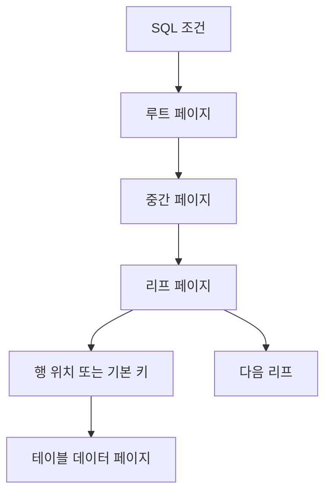

# 데이터베이스 인덱스의 내부 구현

- 인덱스는 검색 조건을 데이터 페이지까지 빠르게 연결하는 별도 자료구조다.
- 대부분의 디스크 기반 DB는 정렬된 **B+Tree**를 사용하며, 리프 노드가 실제 위치 또는 행 식별자를 가진다.
- 조회는 빨라지지만 인덱스 저장 공간과 `INSERT/UPDATE/DELETE` 비용이 증가한다.

## 개념 설명

인덱스는 보통 `키 → 레코드 위치`를 저장한다. B+Tree의 내부 노드는 키 범위와 자식 페이지 포인터를 보유하고, 리프 노드는 정렬된 키와 행 위치를 보유한다. 모든 리프가 연결 리스트로 이어져 있어 범위 검색이 효율적이다.

페이지는 디스크 I/O의 기본 단위다. 트리의 높이가 3이라면 루트, 중간 노드, 리프를 차례로 읽어 적은 횟수로 원하는 페이지를 찾는다. 실제로는 버퍼 풀에 자주 사용되는 페이지가 캐시되므로 루트와 상위 노드는 메모리에 남을 가능성이 높다. 인덱스 탐색 비용은 대략 `O(log N)`이지만, 결과 행이 많으면 테이블 페이지를 반복해서 읽는 비용이 커진다.

클러스터형 인덱스는 테이블 데이터 자체가 인덱스 순서로 저장되는 구조다. InnoDB의 기본 키가 대표적이며, 리프에 행 데이터가 있다. 보조 인덱스의 리프에는 기본 키가 저장되므로, 보조 인덱스 탐색 후 기본 키 인덱스를 다시 찾는 **두 번의 탐색**이 발생할 수 있다. 필요한 컬럼을 인덱스가 모두 포함하면 테이블 접근을 생략하는 커버링 인덱스가 된다.

삽입 시 리프가 가득 차면 페이지 분할이 발생한다. 레코드를 둘로 나누고 상위 노드에 구분 키를 전파하므로 쓰기 증폭과 페이지 파편화가 생긴다. 삭제는 즉시 병합하지 않고 삭제 표시만 남길 수도 있다. 따라서 카디널리티, 선택도, 정렬 방향, 변경 빈도를 고려해야 하며, 모든 컬럼에 인덱스를 만들면 안 된다.

```sql
CREATE INDEX idx_orders_user_date
ON orders (user_id, created_at DESC);

EXPLAIN SELECT id, created_at
FROM orders
WHERE user_id = 42
ORDER BY created_at DESC
LIMIT 20;
```



## 면접 질문

### 1. B-Tree보다 B+Tree를 데이터베이스 인덱스에 자주 사용하는 이유는?

모든 실제 데이터가 리프에 모이고 리프끼리 연결되므로, 트리 높이를 낮추면서 범위 검색과 순차 스캔을 효율적으로 수행할 수 있기 때문이다.

### 2. 복합 인덱스 `(A, B)`가 `WHERE B = ?` 조건에 항상 효과적인가?

아니다. 정렬 기준이 먼저 `A`이므로 선두 컬럼을 건너뛴 조건은 인덱스 탐색 범위를 충분히 줄이지 못한다. 이를 왼쪽 접두사 규칙이라고 한다.

> **한 줄 정리:** 인덱스는 B+Tree와 페이지 I/O를 이용해 읽기를 줄이지만, 저장 공간과 쓰기 비용을 대가로 요구한다.
