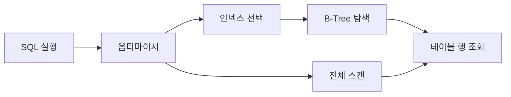

# 데이터베이스 인덱스

- 인덱스는 검색 속도를 높이는 대신 저장 공간과 쓰기 비용을 추가한다.
- 복합 인덱스는 컬럼 순서가 중요하며, 일반적으로 선택도가 높고 자주 조건에 사용되는 컬럼을 앞에 둔다.
- 인덱스가 있어도 옵티마이저가 비용을 계산해 테이블 전체 스캔을 선택할 수 있다.

## 개념 설명

인덱스는 책의 목차처럼 특정 컬럼의 값과 실제 행의 위치를 별도로 저장한 자료구조다. 대부분의 관계형 데이터베이스는 범위 검색에 유리한 **B-Tree 계열**을 기본으로 사용한다. `WHERE`, `JOIN`, `ORDER BY` 조건에 맞는 인덱스가 있으면 전체 행을 읽는 대신 필요한 위치를 빠르게 찾을 수 있다.

하지만 인덱스가 항상 성능을 보장하지는 않는다. 조건에 맞는 행이 너무 많으면 인덱스를 거쳐 테이블을 읽는 비용보다 전체 스캔이 저렴할 수 있다. 또한 컬럼에 함수를 적용하거나 암시적 형 변환이 발생하면 인덱스를 제대로 사용하지 못할 수 있다.

복합 인덱스 `(a, b)`는 보통 `a` 또는 `a, b` 조건에는 효과적이지만, `b`만 조건으로 사용하는 경우에는 제한적이다. 이를 **왼쪽부터 선행하는 규칙**이라고 한다. 인덱스 컬럼 순서는 실제 조회 패턴, 선택도, 정렬 요구를 함께 고려해야 한다.

인덱스가 많으면 `INSERT`, `UPDATE`, `DELETE` 때마다 인덱스도 갱신해야 하므로 쓰기 성능과 저장 공간이 악화된다. 따라서 무조건 추가하지 말고 실행 계획으로 검증해야 한다. `EXPLAIN`을 통해 인덱스 사용 여부, 예상 행 수, 조인 방식 등을 확인하는 것이 실무의 기본이다.

## 코드 예시

```sql
CREATE INDEX idx_orders_customer_date
ON orders (customer_id, created_at);

EXPLAIN
SELECT order_id, created_at
FROM orders
WHERE customer_id = 10
  AND created_at >= '2025-01-01'
ORDER BY created_at DESC;
```

## 동작 흐름



## 면접 질문

### 1. 인덱스의 장단점은 무엇인가요?

검색과 정렬, 조인 성능을 높이는 장점이 있지만 별도 저장 공간이 필요하고, 데이터 변경마다 인덱스를 갱신해야 하므로 쓰기 성능이 저하될 수 있습니다. 또한 인덱스가 있어도 선택도가 낮거나 조회 대상이 많으면 전체 스캔이 더 효율적일 수 있습니다.

### 2. 복합 인덱스의 컬럼 순서는 어떻게 정하나요?

실제 조회 조건과 정렬 패턴을 우선 고려합니다. 일반적으로 동등 비교 조건을 앞에 두고, 범위 조건이나 정렬에 사용되는 컬럼을 뒤에 배치합니다. 단순히 카디널리티가 높은 컬럼을 무조건 앞에 두는 것이 아니라, 실행 계획과 실제 데이터 분포로 검증해야 합니다.

**한 줄 정리:** 인덱스는 많이 만드는 것이 아니라, 조회 패턴과 실행 계획에 맞게 최소한으로 설계해야 한다.
