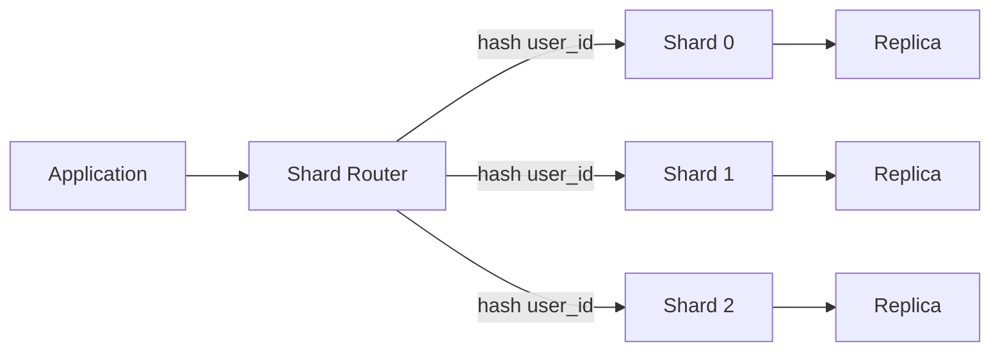

# Sharding과 Partitioning: 자주 하는 실수와 안티패턴

- **Partitioning**은 하나의 논리적 데이터베이스 안에서 데이터를 나누는 방식이고, **Sharding**은 여러 DB 서버로 분산하는 방식이다.
- 성능보다 먼저 **접근 패턴, 샤드 키의 균등성, 운영 복잡도**를 검토해야 한다.
- 가장 위험한 문제는 잘못된 키로 인한 **핫 샤드**, 샤드 간 조인·트랜잭션, 그리고 어려운 리샤딩이다.

## 개념 설명

Partitioning은 보통 한 DB 인스턴스 내부에서 테이블이나 인덱스를 분할한다. 행을 나누는 수평 파티셔닝, 컬럼을 나누는 수직 파티셔닝, 그리고 범위·해시·리스트 파티셔닝이 있다. 예를 들어 날짜 기준 range partition은 오래된 데이터 삭제와 기간 조회에 유리하다.

Sharding은 데이터를 여러 DB 노드에 분산한다. 애플리케이션 또는 프록시가 샤드 키를 기준으로 요청을 라우팅한다. `user_id` 해시는 균등 분산에 유리하지만, 특정 기간 조회에는 여러 샤드를 조회해야 할 수 있다. 반대로 날짜 키는 시간 범위 조회가 쉽지만 최신 데이터 샤드에 쓰기가 몰릴 수 있다.

### 자주 하는 실수와 안티패턴

1. **증가하는 시간값만 샤드 키로 사용**  
   최신 샤드에 쓰기가 집중되는 핫스팟이 생긴다. 시간 버킷과 해시를 조합하거나 쓰기 분산 전략을 둔다.

2. **카디널리티가 낮은 키 사용**  
   `country`, `status`처럼 값 종류가 적은 컬럼은 특정 샤드에 데이터가 편중된다. 분포와 예상 성장량을 사전에 측정한다.

3. **쿼리 조건에 샤드 키를 넣지 않음**  
   모든 샤드에 요청하는 scatter-gather가 되어 지연시간과 네트워크 비용이 커진다. 주요 조회 API는 샤드 키를 함께 받도록 설계한다.

4. **샤드 간 조인과 트랜잭션을 당연하게 사용**  
   분산 조인은 비싸고, 2PC는 가용성과 운영 난도를 높인다. 데이터 중복, 애플리케이션 조합, 이벤트 기반 최종 일관성을 검토한다.

5. **리샤딩·장애 복구를 나중에 생각함**  
   해시 모듈러만 바꾸면 대부분의 데이터가 이동한다. consistent hashing, 가상 노드, 온라인 마이그레이션과 검증 절차를 준비한다.

6. **전역 유니크 키와 순서 보장을 과소평가**  
   auto-increment는 샤드별 충돌이나 전역 정렬 문제가 생긴다. UUID, Snowflake 계열 ID를 사용하되 인덱스 크기와 시간 정렬 특성을 확인한다.

## 코드 예시

```sql
CREATE TABLE orders (
  id BIGINT,
  user_id BIGINT NOT NULL,
  created_at TIMESTAMP NOT NULL
) PARTITION BY RANGE (created_at);

CREATE TABLE orders_2025_q1
  PARTITION OF orders
  FOR VALUES FROM ('2025-01-01') TO ('2025-04-01');

SELECT *
FROM orders
WHERE created_at >= '2025-01-01'
  AND created_at < '2025-04-01'
  AND user_id = 42;
```

## 요청 라우팅 구조



## 면접 질문

1. **Partitioning과 Sharding의 차이는?**  
   Partitioning은 주로 한 DB 내부의 논리적·물리적 분할이고, Sharding은 여러 DB 노드로 데이터를 분산해 수평 확장하는 방식이다.

2. **좋은 샤드 키의 조건은?**  
   데이터와 트래픽이 균등하게 분산되고, 주요 쿼리에 자주 포함되며, 변경되지 않고, 리샤딩 비용이 낮아야 한다.

## 한 줄 정리

**샤딩은 단순한 분할이 아니라 쿼리 라우팅·일관성·리샤딩·장애 복구까지 포함한 운영 설계다.**
