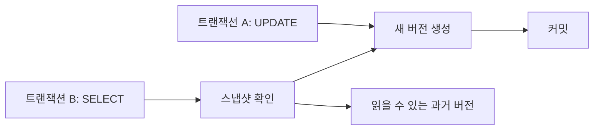

# MVCC(Multi-Version Concurrency Control)

- **핵심 목표:** 읽기 작업이 쓰기 작업을 불필요하게 차단하지 않도록 여러 데이터 버전을 관리한다.
- **동작 방식:** 각 트랜잭션의 시작 시점 또는 커밋 시점을 기준으로 자신에게 보이는 버전을 선택한다.
- **주의할 점:** MVCC는 모든 동시성 문제를 해결하지 않으며, 격리 수준·락·Undo 저장 공간·오래 열린 트랜잭션과 함께 이해해야 한다.

## 개념 설명

MVCC는 하나의 레코드를 덮어쓰는 대신 변경 이력을 버전으로 보관하는 동시성 제어 방식이다. 트랜잭션이 데이터를 수정하면 기존 버전은 즉시 삭제되지 않고, 새 버전이 생성된다. 읽기 트랜잭션은 자신의 스냅샷에서 보이는 커밋 버전을 읽으므로, 다른 트랜잭션의 쓰기 락을 기다리지 않고 일관된 데이터를 조회할 수 있다.

구현 방식은 DBMS마다 다르다. PostgreSQL은 튜플의 트랜잭션 ID와 가시성 정보를 이용하고, InnoDB는 레코드의 숨은 메타데이터와 Undo 로그를 이용해 과거 버전을 복원한다. 따라서 MVCC는 “버전을 무한히 저장한다”는 뜻이 아니라, 필요한 기간 동안 과거 버전을 유지하고 정리한다는 의미에 가깝다.

격리 수준에 따라 관찰 결과가 달라진다. Read Committed에서는 문장마다 최신 커밋 스냅샷을 사용할 수 있어 같은 트랜잭션에서 같은 조회 결과가 달라질 수 있다. Repeatable Read에서는 트랜잭션 동안 스냅샷을 유지해 반복 읽기를 안정화한다. Serializable은 추가적인 락이나 검증을 통해 직렬 실행과 유사한 결과를 보장한다.

MVCC의 장점은 읽기-쓰기 충돌을 줄이고 읽기 성능을 높이는 것이다. 반면 오래 열린 트랜잭션은 과거 버전 삭제를 막아 Undo 영역, 테이블 저장 공간, Vacuum 비용을 증가시킬 수 있다. 또한 재고 차감처럼 충돌 방지가 필요한 작업은 `SELECT ... FOR UPDATE` 같은 비관적 락이나 원자적 조건 업데이트가 필요하다.

```sql
BEGIN;
SELECT stock FROM product WHERE id = 10 FOR UPDATE;
UPDATE product
SET stock = stock - 1
WHERE id = 10 AND stock > 0;
COMMIT;
```



## 면접 질문

### 1. MVCC와 락 기반 동시성 제어의 차이는 무엇인가요?

MVCC는 읽는 트랜잭션이 적절한 과거 버전을 읽게 해 읽기-쓰기 충돌을 줄인다. 락 기반 방식은 공유 락·배타 락으로 접근 자체를 통제한다. 실제 DB는 MVCC와 락을 함께 사용하며, MVCC가 쓰기 충돌이나 모든 격리 문제까지 해결하지는 않는다.

### 2. MVCC에서 오래 실행되는 트랜잭션이 왜 문제인가요?

해당 트랜잭션이 볼 수 있는 과거 버전을 보존해야 하므로 DB가 이를 정리하지 못한다. 그 결과 Undo 로그나 테이블이 커지고 Vacuum·Purge 비용이 증가하며 성능과 저장 공간에 악영향을 준다. 트랜잭션은 짧게 유지하고 커넥션 풀의 유휴 트랜잭션도 점검해야 한다.

> **한 줄 정리:** MVCC는 스냅샷과 데이터 버전으로 읽기 동시성을 높이지만, 격리 수준·락·오래 열린 트랜잭션까지 함께 관리해야 한다.
