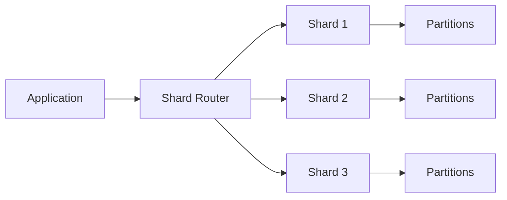

# Sharding과 Partitioning: 성능 최적화 관점

- **Partitioning**은 하나의 논리적 테이블·데이터셋을 여러 물리 파티션으로 나누는 방식이며, 보통 단일 DB 내부에서 관리한다.
- **Sharding**은 데이터를 여러 DB 서버나 노드로 분산해 저장하는 방식이다. 저장 용량과 처리량을 수평 확장할 수 있다.
- 성능의 핵심은 **균등한 분산**, **효율적인 라우팅**, **파티션 프루닝**, **크로스 샤드 작업 최소화**다.

## 개념 설명

Partitioning은 테이블을 여러 구간으로 나누는 기법이다. 대표적으로 시간 범위를 나누는 **Range**, 해시값으로 분산하는 **Hash**, 특정 목록으로 나누는 **List** 방식이 있다. 예를 들어 로그 테이블을 월별 Range 파티션으로 나누면 최근 한 달 데이터만 조회하는 쿼리가 전체 데이터를 스캔하지 않아도 된다. 이를 **Partition Pruning**이라고 한다.

Sharding은 여러 독립적인 DB 노드에 데이터를 분산한다. 각 데이터가 저장될 노드를 결정하는 기준을 **Shard Key**라고 한다. 사용자 ID처럼 분포가 고르고 대부분의 조회 조건에 포함되는 키가 적합하다. 반대로 특정 고객이나 지역에 요청이 몰리면 한 노드만 과부하되는 **Hot Shard**가 발생한다.

성능 최적화 시 다음을 고려한다.

1. **키 선택**: 균등한 카디널리티와 높은 조회 활용도를 가진 키를 선택한다.
2. **라우팅 비용**: 애플리케이션 또는 프록시가 대상 파티션·샤드를 즉시 찾도록 매핑 정보를 관리한다.
3. **데이터 지역성**: 함께 조회되는 데이터를 같은 파티션이나 샤드에 배치해 조인과 네트워크 비용을 줄인다.
4. **리밸런싱**: 노드 추가 시 대량 데이터 이동이 발생하므로 consistent hashing, 가상 노드, 점진적 마이그레이션을 활용한다.
5. **운영 지표**: 평균 응답 시간뿐 아니라 P95/P99 latency, 샤드별 QPS, 저장 용량, 스큐를 관찰한다.

Partitioning은 관리와 트랜잭션 일관성이 비교적 쉽지만 단일 서버 자원 한계가 남는다. Sharding은 수평 확장에 강하지만 분산 트랜잭션, 글로벌 정렬, 중복 집계, 장애 복구가 복잡해진다. 따라서 데이터 규모와 병목이 실제로 단일 노드 한계를 넘는 경우에 적용해야 한다.

## 예시: PostgreSQL Range Partitioning

```sql
CREATE TABLE events (
  id BIGINT,
  occurred_at DATE NOT NULL,
  payload JSONB
) PARTITION BY RANGE (occurred_at);

CREATE TABLE events_2025_01
  PARTITION OF events
  FOR VALUES FROM ('2025-01-01') TO ('2025-02-01');

CREATE INDEX ON events_2025_01 (occurred_at);
```

`occurred_at` 조건이 포함된 쿼리는 관련 월 파티션만 읽을 수 있다. 단, 함수로 컬럼을 감싸거나 파티션 키 조건이 없으면 프루닝 효과가 줄어든다.



## 면접 질문

**Q1. Sharding Key는 어떻게 선택하나요?**  
A. 데이터가 균등하게 분산되고, 주요 조회·수정 요청에 자주 사용되며, 크로스 샤드 조인을 줄일 수 있는 키를 선택합니다.

**Q2. Partitioning과 Sharding의 차이는 무엇인가요?**  
A. Partitioning은 주로 하나의 DB 안에서 데이터를 나누고, Sharding은 여러 DB 노드로 데이터를 분산해 수평 확장합니다.

> **한 줄 정리:** 좋은 분할 키와 데이터 지역성이 성능을 결정하며, 분산에 따른 라우팅·리밸런싱·크로스 샤드 비용까지 함께 설계해야 한다.
