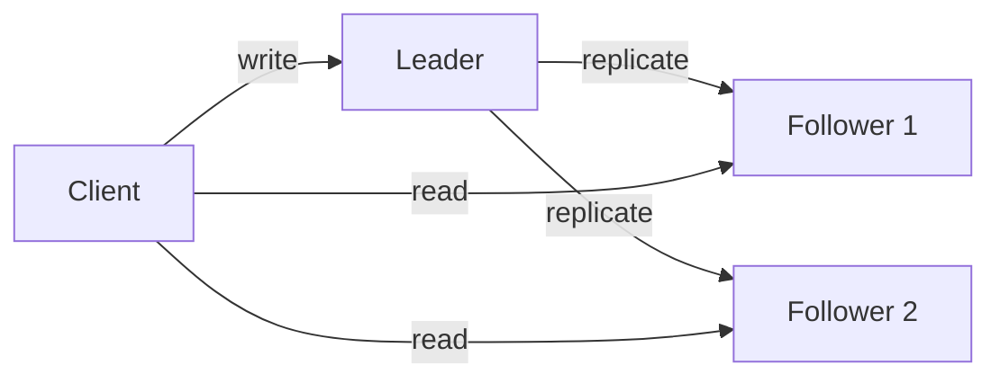

# Replication(복제)

- 데이터를 여러 노드에 중복 저장해 **가용성, 장애 복구, 읽기 확장성**을 높인다.
- 동기 복제는 일관성이 강하지만 지연이 커질 수 있고, 비동기 복제는 빠르지만 **복제 지연과 데이터 유실** 가능성이 있다.
- 면접에서는 Leader-Follower 구조, 장애 조치(Failover), Split Brain, Read-after-Write 일관성을 자주 묻는다.

## 개념 설명

Replication은 하나의 원본 데이터를 여러 서버에 복사해 저장하는 기술이다. 데이터베이스, Redis, Kafka 등에서 장애 대응과 성능 향상을 위해 사용한다. 샤딩이 데이터를 여러 노드에 **분산**하는 기술이라면, 복제는 같은 데이터를 여러 노드에 **중복** 저장하는 기술이다. 두 방식은 함께 사용할 수 있다.

가장 일반적인 구조는 Leader-Follower다. 쓰기는 Leader가 처리하고, 변경 로그를 Follower에 전달한다. 읽기는 Follower로 분산할 수 있어 읽기 처리량이 증가한다. 단, Follower가 최신 상태가 아닐 수 있으므로 사용자가 방금 변경한 데이터를 즉시 읽어야 한다면 Leader로 읽거나 세션 단위의 Read-after-Write 보장이 필요하다.

동기 복제는 Leader가 여러 Follower의 저장 완료를 확인한 뒤 응답한다. 장애 시 데이터 유실이 적지만 네트워크 지연이나 Follower 장애가 쓰기 지연으로 이어진다. 비동기 복제는 Leader가 먼저 응답하므로 빠르지만, Leader가 저장 후 복제 전에 장애가 나면 일부 변경이 사라질 수 있다.

Leader 장애 시 Follower를 새 Leader로 승격하는 Failover가 필요하다. 이때 오래된 Follower가 승격되면 데이터가 롤백될 수 있다. 또한 네트워크 분할 상황에서 두 노드가 동시에 Leader가 되는 Split Brain을 막기 위해 과반수 투표, 임대(Lease), 펜싱(Fencing) 같은 장치를 사용한다. 복제 지연은 모니터링해야 하며, 지연이 커지면 읽기 일관성 저하와 장애 복구 실패로 이어질 수 있다.

## 면접 질문 1

**동기 복제와 비동기 복제의 차이는 무엇인가요?**

동기 복제는 복제본 저장을 확인한 후 성공을 반환해 데이터 유실 가능성이 낮지만 지연과 장애 전파가 커진다. 비동기 복제는 빠르게 응답하지만 장애 시 아직 전달되지 않은 데이터가 유실될 수 있다. 금융 거래처럼 강한 내구성이 필요하면 동기 방식이나 과반수 커밋을 고려한다.

## 면접 질문 2

**Replication과 Sharding의 차이는 무엇인가요?**

Replication은 동일한 데이터를 여러 노드에 복사해 가용성과 읽기 확장을 얻는다. Sharding은 데이터를 키 기준으로 나눠 저장해 저장 용량과 쓰기 처리량을 확장한다. 대규모 시스템에서는 샤드마다 복제본을 두는 방식으로 함께 사용한다.

> **한 줄 정리:** Replication은 장애에 강하고 읽기를 확장하지만, 복제 지연·일관성·Failover·Split Brain을 함께 설계해야 한다.
