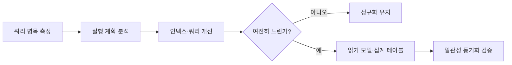

# 정규화와 반정규화: 성능 최적화 관점

- **정규화**는 중복 데이터를 줄여 저장 공간과 변경 이상을 줄이지만, 조회 시 조인이 증가할 수 있다.
- **반정규화**는 조회에 필요한 데이터를 미리 합치거나 복제해 읽기 성능을 높이지만, 갱신 비용과 데이터 불일치 위험이 커진다.
- 성능 최적화의 핵심은 원칙적으로 정규화한 뒤, **실제 쿼리 패턴과 병목을 측정하고 선택적으로 반정규화**하는 것이다.

## 개념 설명

정규화는 테이블을 주제별로 분리하고 함수적 종속성을 기준으로 중복을 제거하는 설계 방식이다. 제1정규형은 원자값, 제2정규형은 부분 함수 종속 제거, 제3정규형은 이행 함수 종속 제거가 핵심이다. 예를 들어 주문 테이블에 고객 주소를 반복 저장하면 주소 변경 시 여러 행을 수정해야 하므로 갱신 이상이 발생한다.

정규화된 구조는 `Customer`, `Order`, `OrderItem`, `Product`처럼 데이터를 분리한다. 이 구조는 쓰기 일관성, 저장 공간, 무결성 측면에서 유리하지만 주문 목록과 고객명, 상품명을 함께 조회할 때 여러 조인이 필요하다. 조인 자체가 항상 느린 것은 아니며, 적절한 인덱스와 실행 계획이 더 중요하다.

반정규화는 자주 조회하는 값을 복제하거나 집계 결과를 저장하는 방식이다. 예를 들어 주문에 고객명을 저장하거나 상품별 판매량을 별도 테이블에 유지할 수 있다. 이를 통해 조인과 집계 비용, 네트워크 왕복을 줄일 수 있지만 변경 시 여러 위치를 갱신해야 한다. 갱신 누락을 방지하려면 트랜잭션, 제약조건, 이벤트 기반 동기화 또는 배치 검증이 필요하다.

최적화 순서는 `실행 계획 확인 → 인덱스 조정 → 쿼리 개선 → 캐시·읽기 복제 검토 → 필요한 부분만 반정규화`가 안전하다. 특히 쓰기 빈도가 높고 데이터 정확성이 중요한 영역은 정규화를 유지하고, 대시보드·검색·피드처럼 읽기 비율이 높고 약간의 지연을 허용할 수 있는 영역은 읽기 모델이나 집계 테이블을 고려한다.

## SQL 예시

```sql
-- 정규화된 주문 조회
SELECT o.id, c.name, p.name, oi.quantity
FROM orders o
JOIN customers c ON c.id = o.customer_id
JOIN order_items oi ON oi.order_id = o.id
JOIN products p ON p.id = oi.product_id
WHERE o.created_at >= '2025-01-01';

-- 조회가 매우 많다면 선택적 반정규화
ALTER TABLE orders ADD COLUMN customer_name_snapshot VARCHAR(100);
CREATE INDEX idx_orders_created_at ON orders(created_at);
```



## 면접 질문

### 1. 정규화하면 항상 성능이 좋아지나요?

아니다. 중복과 쓰기 비용은 줄지만 조회 조인이 증가할 수 있다. 다만 조인 성능은 인덱스와 데이터 분포, 실행 계획에 따라 달라지므로 측정이 우선이다.

### 2. 반정규화의 대표적인 부작용은 무엇인가요?

데이터 중복으로 인한 불일치와 갱신 비용 증가다. 트랜잭션 범위를 명확히 하거나 이벤트·배치 검증으로 동기화 실패를 관리해야 한다.

> **한 줄 정리:** 정규화를 기본값으로 삼고, 측정된 읽기 병목에만 일관성 비용을 감수하며 반정규화를 적용하라.
