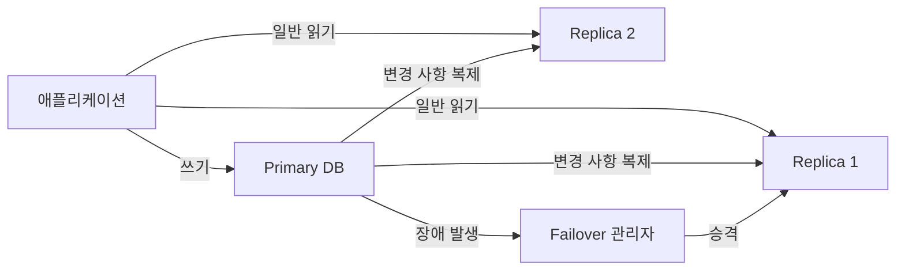

# Replication(복제)

## 핵심 3가지

- 데이터를 여러 서버에 복사해 **장애 대응과 읽기 확장**을 가능하게 한다.
- Primary(Leader)는 쓰기를 처리하고 Replica(Follower)는 데이터를 전달받아 저장하는 방식이 흔하다.
- 복제 지연과 일관성 수준을 고려하지 않으면 **오래된 데이터 조회**나 잘못된 장애 전환이 발생할 수 있다.

## 개념 설명

Replication은 하나의 데이터를 여러 장소에 똑같이 저장하는 기술이다. 중요한 공책을 한 권만 가지고 있다가 잃어버리면 모든 기록이 사라지지만, 복사본을 친구와 나누어 보관하면 한 권이 망가져도 복구할 수 있다. 데이터베이스도 이와 같이 서버 간 복사본을 만든다.

가장 일반적인 구조는 **Primary-Replica**다. 애플리케이션의 쓰기 요청은 Primary가 받고, Primary의 변경 내용을 Replica에 전달한다. 읽기 요청은 Replica로 분산하면 Primary의 부담을 줄이고 처리량을 높일 수 있다. Primary 장애 시 Replica를 새 Primary로 승격하는 장애 조치(Failover)도 가능하다.

복제 방식은 크게 두 가지다. **동기 복제**는 Primary가 Replica의 저장 완료까지 확인한 뒤 성공을 응답한다. 데이터 유실 가능성이 작지만 지연 시간이 늘어난다. **비동기 복제**는 Primary가 먼저 응답하고 Replica가 나중에 따라간다. 빠르지만 Primary 장애 직전에 복사되지 않은 데이터가 사라질 수 있다.

Replica가 아직 최신 변경을 반영하지 못한 상태를 **복제 지연(Replication Lag)**이라 한다. 사용자가 방금 비밀번호를 변경했는데 직후 Replica에서 조회하면 예전 값이 보일 수 있다. 따라서 쓰기 직후 읽기는 Primary로 보내거나, 필요한 경우 읽기 일관성 정책을 적용한다. 복제는 백업과 같지 않다. 잘못된 삭제도 모든 복제본에 전파되므로 별도의 시점 복구 백업이 필요하다.

```python
def update_profile(user_id, data):
    primary.write(user_id, data)
    return primary.read(user_id)  # 쓰기 직후에는 최신 Primary 조회

def get_profile(user_id):
    return replica.read(user_id)  # 일반 조회는 Replica로 분산
```



## 면접 질문

### 1. 복제와 샤딩의 차이는 무엇인가요?

복제는 **같은 데이터 전체를 여러 서버에 저장**하는 방식이다. 샤딩은 데이터를 분할해 각 서버가 **서로 다른 일부 데이터**를 저장하는 방식이다. 복제는 가용성과 읽기 확장, 샤딩은 저장 용량과 쓰기 확장에 주로 사용한다.

### 2. 비동기 복제의 장애 상황에서 데이터 유실이 가능한 이유는 무엇인가요?

Primary가 성공 응답을 보낸 뒤 Replica에 변경 내용을 전달하기 전에 장애가 날 수 있기 때문이다. 이때 Replica를 승격하면 아직 복제되지 않은 변경 사항이 사라질 수 있다.

## 한 줄 정리

Replication은 데이터를 여러 서버에 복사해 가용성과 읽기 성능을 높이지만, 복제 지연·일관성·장애 조치를 함께 설계해야 한다.
