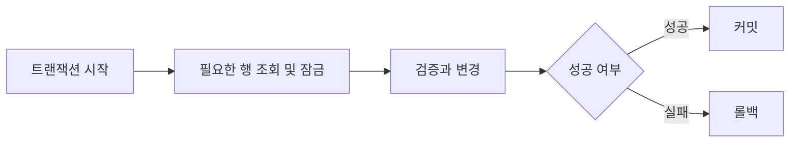

# 트랜잭션과 ACID: 성능 최적화 관점

- **원자성·일관성**: 작업을 모두 반영하거나 전부 취소하며, 제약조건을 깨지 않는 상태만 커밋한다.
- **격리성**: 동시 트랜잭션 간 간섭을 제어한다. 격리 수준이 높을수록 정합성은 좋아지지만 락 대기와 처리량 저하가 커질 수 있다.
- **지속성**: 커밋된 데이터는 장애 후에도 보존된다. 로그 기록과 디스크 동기화 비용이 성능에 영향을 준다.

## 개념 설명

트랜잭션은 여러 데이터 변경을 하나의 논리적 작업으로 묶는다. 예를 들어 계좌 이체는 출금과 입금이 모두 성공해야 하므로 하나의 트랜잭션이어야 한다. **Atomicity**는 중간 실패 시 전체 롤백을 보장하고, **Consistency**는 잔액 음수 금지 같은 제약조건을 유지한다. **Isolation**은 동시에 실행되는 트랜잭션의 결과가 서로 안전하게 보이도록 하며, **Durability**는 커밋 결과를 장애 이후에도 복구 가능하게 한다.

성능 최적화의 핵심은 트랜잭션을 **짧고 작게 유지하는 것**이다. 네트워크 호출, 파일 처리, 사용자 입력 대기를 트랜잭션 안에 넣으면 락 점유 시간이 늘어난다. 필요한 SQL만 포함하고, 조건절과 조인 컬럼에는 적절한 인덱스를 둬 스캔과 락 범위를 줄인다. 대량 처리에서는 건별 커밋보다 적절한 크기의 배치 커밋이 로그 flush와 왕복 비용을 줄인다.

격리 수준은 업무 요구에 맞춘다. `READ COMMITTED`는 일반적인 기본값으로 더티 리드를 막고, `REPEATABLE READ`는 반복 조회의 일관성을 강화하지만 락 또는 MVCC 버전 관리 비용이 증가할 수 있다. 재고 차감처럼 충돌이 잦은 작업은 낙관적 락의 버전 컬럼이나 원자적 조건부 UPDATE를 검토한다. 데드락은 일관된 테이블 접근 순서, 짧은 트랜잭션, 적절한 인덱스로 줄이고, 발생 자체를 가정해 제한적 재시도도 구현한다.

## 코드 예시

```sql
BEGIN;

-- 인덱스: orders(user_id, status)
SELECT id
FROM orders
WHERE user_id = ? AND status = 'READY'
FOR UPDATE;

UPDATE orders
SET status = 'PROCESSING', version = version + 1
WHERE id = ? AND version = ?;

COMMIT;
```

`FOR UPDATE`는 필요한 행만 잠그도록 조회 조건과 인덱스를 설계해야 한다. 애플리케이션에서는 예외 발생 시 반드시 롤백하고, 커밋 직전까지 외부 API 호출을 수행하지 않는다.



## 면접 질문

1. **격리 수준을 높이면 왜 성능이 떨어질 수 있나요?**  
   더 많은 락, 긴 락 대기, MVCC 버전 관리, 충돌 재시도가 발생해 동시 처리량이 감소할 수 있습니다.

2. **트랜잭션을 짧게 만드는 방법은 무엇인가요?**  
   SQL 범위를 최소화하고 인덱스를 사용하며, 외부 호출과 불필요한 계산을 트랜잭션 밖으로 이동하고, 대량 작업은 배치 단위로 처리합니다.

> **한 줄 정리:** ACID를 유지하면서 성능을 높이려면 격리 수준을 업무에 맞추고, 인덱스로 잠금 범위를 줄이며, 트랜잭션을 짧게 설계하라.
