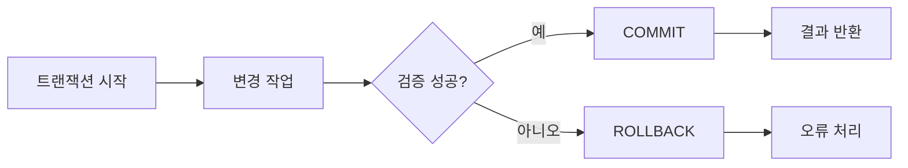

# 트랜잭션과 ACID: 실무 트러블슈팅

- **Atomicity**: 여러 작업을 전부 성공시키거나 전부 취소한다.
- **Consistency·Isolation**: 제약조건을 지키며, 동시 실행 중간 상태가 서로에게 노출되지 않게 한다.
- **Durability**: 커밋된 결과는 장애나 재시작 후에도 보존된다.

## 개념 설명

트랜잭션은 하나의 논리적 작업 단위다. 예를 들어 계좌 이체는 출금과 입금을 함께 처리해야 하며, 한쪽만 반영되면 데이터가 깨진다. `COMMIT`은 변경을 확정하고, `ROLLBACK`은 트랜잭션 시작 이후의 변경을 되돌린다.

ACID는 절대적인 성능 보장이 아니라 데이터 정합성을 위한 원칙이다. 특히 Isolation은 DB의 격리 수준에 따라 동작이 달라진다.

- **Read Uncommitted**: 커밋되지 않은 변경도 읽을 수 있어 Dirty Read가 발생할 수 있다.
- **Read Committed**: 커밋된 데이터만 읽지만, 같은 트랜잭션에서 재조회 결과가 달라질 수 있다.
- **Repeatable Read**: 같은 행을 반복 조회할 때 일관성을 높인다. DB에 따라 팬텀 리드 처리 방식은 다르다.
- **Serializable**: 가장 강한 격리 수준이지만 잠금과 대기 증가로 성능 저하가 크다.

실무에서 흔한 문제는 “트랜잭션이 안 끝나 커넥션 풀이 고갈되는 현상”이다. 트랜잭션 내부에서 외부 API 호출, 파일 업로드, 긴 계산을 수행하면 잠금 유지 시간이 길어진다. 트랜잭션은 가능한 한 짧게 유지하고, 외부 작업은 커밋 전후로 분리한다.

데드락은 두 트랜잭션이 서로의 잠금 해제를 기다리는 상태다. 로그에서 `deadlock`, `lock wait timeout`, 대기 시간, SQL 순서를 확인한다. 해결책은 테이블·행 접근 순서를 통일하고, 적절한 인덱스를 추가하며, 짧은 트랜잭션과 제한적인 재시도 정책을 적용하는 것이다. 재시도 시에는 동일 요청이 중복 처리되지 않도록 멱등성을 보장해야 한다.

장애 분석 시에는 트랜잭션 시작·커밋·롤백 로그, 트랜잭션 ID, 커넥션 풀 사용량, 활성 세션, 잠금 대기, 격리 수준을 함께 확인한다. 애플리케이션 예외를 잡고도 롤백하지 않거나, 자동 커밋 설정을 오해하는 문제도 자주 발생한다.

## 코드 예시

```sql
START TRANSACTION;

UPDATE accounts
SET balance = balance - 10000
WHERE id = 1 AND balance >= 10000;

-- 영향받은 행이 1인지 애플리케이션에서 확인
UPDATE accounts
SET balance = balance + 10000
WHERE id = 2;

COMMIT;
-- 예외 또는 검증 실패 시 ROLLBACK
```

## 처리 흐름



## 면접 질문

### 1. 트랜잭션 내부에서 외부 API 호출을 피해야 하는 이유는?

응답 지연이나 장애가 발생하면 DB 잠금과 커넥션을 오래 점유한다. 외부 호출은 트랜잭션 밖으로 분리하거나 이벤트·보상 작업으로 설계한다.

### 2. 데드락을 줄이는 방법은?

트랜잭션을 짧게 만들고, 여러 자원에 접근하는 순서를 통일하며, 인덱스로 불필요한 잠금 범위를 줄인다. 발생 가능성을 완전히 제거하기 어렵다면 안전한 재시도를 추가한다.

> **한 줄 정리:** 트랜잭션은 짧고 명확하게 유지하며, 장애 분석에서는 커밋·롤백·잠금·커넥션 상태를 함께 추적하라.
