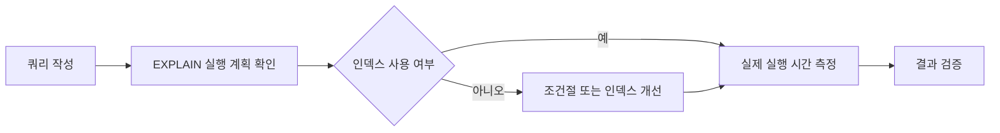

# 쿼리 최적화(Query Optimization)

## 핵심 포인트 3가지

- **실행 계획을 확인하라**: 데이터베이스가 쿼리를 어떤 순서와 방법으로 실행하는지 `EXPLAIN`으로 확인한다.
- **인덱스를 목적에 맞게 사용하라**: 자주 검색하거나 조인하는 컬럼에 인덱스를 만들면 탐색 범위를 줄일 수 있다.
- **필요한 데이터만 요청하라**: `SELECT *` 대신 필요한 컬럼과 행만 조회해 디스크 I/O와 네트워크 전송량을 줄인다.

## 개념 설명

쿼리 최적화는 데이터베이스가 **같은 결과를 더 적은 비용으로 얻도록 쿼리 실행 방법을 개선하는 과정**이다. 데이터가 적을 때는 차이가 작지만, 수백만 건이 쌓이면 쿼리 하나의 실행 방식이 서비스 성능을 크게 좌우한다.

도서관에서 책을 찾는 상황을 생각해 보자. 책이 10권뿐이면 모든 책의 제목을 하나씩 확인해도 괜찮다. 하지만 책이 100만 권이라면 책 제목 색인, 즉 **인덱스**를 사용하는 편이 훨씬 빠르다. 인덱스가 없으면 데이터베이스는 많은 경우 테이블 전체를 처음부터 끝까지 확인하는 **풀 테이블 스캔**을 수행한다.

다만 인덱스가 항상 좋은 것은 아니다. 인덱스도 별도의 자료구조이므로 저장 공간을 사용하고, `INSERT`, `UPDATE`, `DELETE` 때 함께 갱신해야 한다. 따라서 모든 컬럼에 인덱스를 추가하기보다 검색 빈도, 선택도, 정렬 및 조인 조건을 고려해야 한다.

또한 조건절에서 컬럼을 가공하면 인덱스를 제대로 사용하지 못할 수 있다. 예를 들어 `YEAR(created_at) = 2025`보다 `created_at >= ... AND created_at < ...`처럼 범위를 직접 지정하는 방식이 유리하다. 실행 계획에서는 `type`, `key`, `rows`, `Extra` 등을 확인하며 실제 스캔 행 수와 인덱스 사용 여부를 판단한다.

최적화 순서는 보통 **측정 → 실행 계획 확인 → 인덱스와 쿼리 수정 → 다시 측정**이다. 감으로 튜닝하지 말고 실제 데이터 양과 운영 환경에서 검증해야 한다.

```sql
EXPLAIN
SELECT id, name, created_at
FROM orders
WHERE user_id = 42
  AND created_at >= '2025-01-01'
ORDER BY created_at DESC
LIMIT 20;

CREATE INDEX idx_orders_user_date
ON orders (user_id, created_at);
```



## 면접 질문

### 1. 인덱스를 추가했는데도 쿼리가 느릴 수 있는 이유는 무엇인가요?

인덱스의 선택도가 낮거나, 함수·형변환으로 인덱스를 사용하지 못하거나, 조회 범위가 너무 넓을 수 있다. 또한 통계 정보가 오래되어 옵티마이저가 비효율적인 실행 계획을 선택할 수도 있다.

### 2. 복합 인덱스의 컬럼 순서는 어떻게 정하나요?

일반적으로 자주 사용하는 조건과 선택도가 높은 컬럼을 앞에 둔다. 다만 등가 조건, 범위 조건, 정렬·조인 조건을 함께 고려해야 하며, 실제 실행 계획으로 검증해야 한다.

## 한 줄 정리

**쿼리 최적화는 인덱스와 실행 계획을 활용해 데이터베이스가 불필요한 일을 덜 하게 만드는 과정이다.**
