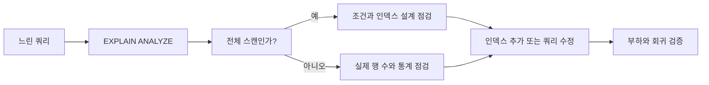

# 데이터베이스 인덱스: 실무 트러블슈팅

- 인덱스는 조회 속도를 높이지만, **쓰기 비용·디스크 사용량·락 경합**을 증가시킨다.
- 느린 쿼리는 인덱스 유무보다 먼저 `EXPLAIN`으로 **실행 계획과 실제 행 수**를 확인해야 한다.
- 복합 인덱스는 컬럼 순서가 핵심이며, 조회 조건·정렬·선택도에 맞춰 설계한다.

## 개념 설명

인덱스는 테이블의 모든 행을 스캔하지 않고 원하는 데이터를 빠르게 찾기 위한 별도 자료구조다. 일반적인 B-Tree 인덱스는 정렬된 키를 기반으로 탐색하므로 등가 조건과 범위 조건에 효과적이다. 대신 `INSERT`, `UPDATE`, `DELETE` 때 인덱스도 갱신해야 하므로 인덱스가 많을수록 쓰기 성능과 저장 공간이 악화된다.

실무에서 가장 먼저 확인할 것은 실행 계획이다. `type=ALL`, 큰 `rows`, 높은 `key_len`, 예상 행 수와 실제 행 수의 큰 차이는 문제 신호다. 통계가 오래되면 옵티마이저가 잘못된 인덱스를 선택할 수 있으므로 통계 갱신이나 재분석을 고려한다.

복합 인덱스 `(tenant_id, status, created_at)`은 일반적으로 왼쪽부터 사용된다. 따라서 `tenant_id` 없이 `status`만 조건에 사용하면 기대한 효과가 없을 수 있다. 선택도가 높은 컬럼을 무조건 앞에 두기보다, 실제 쿼리의 동등 조건·범위 조건·정렬 패턴을 함께 봐야 한다. 범위 조건 뒤의 컬럼은 인덱스 탐색에 제한적으로 사용될 수 있다.

다음 패턴은 인덱스를 무력화하기 쉽다.

- `WHERE DATE(created_at) = ...`처럼 컬럼에 함수를 적용
- `LIKE '%keyword'`처럼 앞에 와일드카드 사용
- 숫자 컬럼과 문자열 파라미터 비교로 인한 암묵적 형변환
- 통계적으로 대부분의 행을 반환하는 낮은 선택도 조건
- 인덱스 컬럼의 순서와 다른 `ORDER BY`, `GROUP BY`

해결책은 범위 조건으로 변환하거나, 데이터 타입을 맞추고, 필요하면 함수 기반 인덱스·부분 인덱스·커버링 인덱스를 검토하는 것이다. 단, 커버링 인덱스는 조회를 빠르게 할 수 있지만 인덱스 크기와 변경 비용이 커진다. 장애 상황에서는 인덱스를 즉시 추가하기보다 느린 쿼리의 빈도, 실행 시간, 쓰기 영향, 기존 인덱스 중복 여부를 함께 확인하고 운영 트래픽이 낮을 때 온라인 DDL을 고려한다.

```sql
CREATE INDEX idx_order_search
ON orders (tenant_id, status, created_at);

EXPLAIN ANALYZE
SELECT id, created_at
FROM orders
WHERE tenant_id = 10
  AND status = 'PAID'
  AND created_at >= '2025-01-01'
ORDER BY created_at DESC
LIMIT 50;

-- 함수 적용 대신 범위 조건 사용
WHERE created_at >= '2025-01-01'
  AND created_at <  '2025-01-02';
```



## 면접 질문

### 1. 복합 인덱스의 컬럼 순서는 어떻게 정하나요?

주요 조회 패턴을 기준으로 정한다. 일반적으로 동등 조건을 앞에 두고, 범위 조건과 정렬 컬럼을 뒤에 배치한다. 단순히 카디널리티가 높은 순서만으로 결정하지 않고 실제 실행 계획과 쿼리 빈도를 검증한다.

### 2. 인덱스가 있는데도 풀 스캔을 하는 이유는 무엇인가요?

조건의 선택도가 낮아 인덱스보다 풀 스캔이 싸거나, 컬럼에 함수를 적용했거나, 앞부분 와일드카드·암묵적 형변환·오래된 통계·잘못된 복합 인덱스 순서가 원인일 수 있다.

**한 줄 정리:** 인덱스는 많이 만드는 것이 아니라, 실행 계획과 실제 트래픽을 근거로 조회 패턴에 맞게 설계하고 검증해야 한다.
