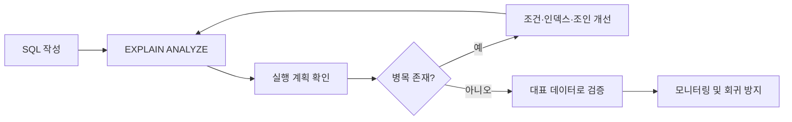

# 쿼리 최적화(Query Optimization)

## 핵심 포인트

- **실행 계획을 먼저 확인한다.** `EXPLAIN`, `EXPLAIN ANALYZE`로 풀스캔, 조인 순서, 예상·실제 행 수를 비교한다.
- **인덱스는 조건·정렬·조인 패턴에 맞게 설계한다.** 단순히 컬럼마다 인덱스를 추가하면 쓰기 비용과 저장 공간이 증가한다.
- **읽는 데이터와 반환하는 데이터를 줄인다.** 필요한 컬럼만 조회하고, 선택도가 높은 조건을 적용하며, 페이지네이션과 N+1 문제를 관리한다.

## 개념 설명

쿼리 최적화는 같은 결과를 더 적은 CPU, 메모리, 디스크 I/O로 반환하도록 SQL과 데이터 구조를 개선하는 과정이다. 데이터베이스 옵티마이저는 통계 정보와 인덱스를 기반으로 실행 계획을 선택하지만, 통계가 오래되었거나 조건식이 비효율적이면 잘못된 계획을 선택할 수 있다.

가장 먼저 실행 계획을 확인한다. `Seq Scan` 또는 `Full Table Scan`이 항상 나쁜 것은 아니지만, 대량 테이블에서 적은 행만 조회하는 경우에는 인덱스 탐색이 유리하다. `rows`와 실제 반환 행 수의 차이가 크다면 통계 갱신이나 데이터 분포를 점검해야 한다.

인덱스는 `WHERE`, `JOIN`, `ORDER BY`에 자주 사용되는 컬럼을 기준으로 설계한다. 복합 인덱스는 일반적으로 왼쪽 컬럼부터 조건에 활용되므로 컬럼 순서가 중요하다. 다만 선택도가 낮은 컬럼만 인덱싱하면 효과가 작을 수 있다.

컬럼에 함수를 적용하거나 앞에 와일드카드를 둔 조건은 인덱스를 사용하기 어렵다. 예를 들어 `DATE(created_at) = ...`, `LIKE '%keyword'`보다 범위 검색이나 별도 검색 구조를 고려한다. `SELECT *`는 불필요한 I/O와 네트워크 비용을 늘리므로 필요한 컬럼만 선택한다.

최적화 후에는 반드시 실제 데이터와 대표 트래픽으로 성능을 검증한다. 평균 응답 시간뿐 아니라 p95, p99 지연 시간과 동시성 상황도 확인해야 한다. 실행 계획을 변경하는 인덱스 추가는 쓰기 성능과 운영 비용까지 함께 평가한다.

## 코드 예제

```sql
-- 비효율적: 함수 적용으로 인덱스 활용이 어려울 수 있음
SELECT id, user_id, created_at
FROM orders
WHERE DATE(created_at) = '2025-01-01'
ORDER BY created_at DESC;

-- 개선: 범위 조건 + 필요한 컬럼만 조회
CREATE INDEX idx_orders_created_user
ON orders (created_at, user_id);

SELECT id, user_id, created_at
FROM orders
WHERE created_at >= '2025-01-01'
  AND created_at <  '2025-01-02'
ORDER BY created_at DESC
LIMIT 50;

EXPLAIN ANALYZE
SELECT id, user_id, created_at
FROM orders
WHERE created_at >= '2025-01-01'
  AND created_at <  '2025-01-02'
ORDER BY created_at DESC
LIMIT 50;
```



## 면접 질문

### 1. `EXPLAIN`과 `EXPLAIN ANALYZE`의 차이는?

`EXPLAIN`은 옵티마이저가 예상한 실행 계획을 보여주고, `EXPLAIN ANALYZE`는 쿼리를 실제 실행해 각 단계의 실제 시간과 행 수를 측정한다. 운영 환경에서는 쓰기 쿼리 실행 여부와 부하를 주의해야 한다.

### 2. 복합 인덱스의 컬럼 순서는 어떻게 정하는가?

주요 조회 패턴을 기준으로 정한다. 일반적으로 동등 비교 조건을 앞에 두고, 범위 조건·정렬 조건을 뒤에 배치한다. 단, 실제 선택도와 실행 계획으로 검증해야 하며 항상 고정된 규칙이 정답은 아니다.

## 한 줄 정리

**쿼리 최적화는 실행 계획으로 병목을 측정하고, 읽는 데이터와 불필요한 작업을 줄이는 과정이다.**
