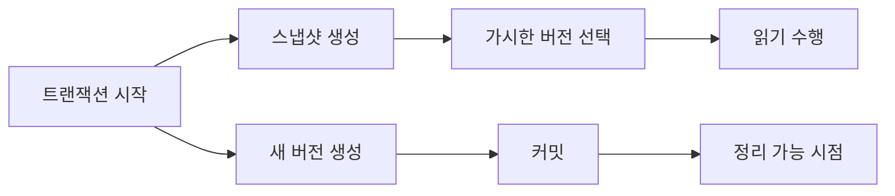

# MVCC(Multi-Version Concurrency Control)

- 읽기와 쓰기를 서로 막지 않도록 레코드의 여러 버전을 관리한다.
- 트랜잭션은 시작 시점의 스냅샷을 기준으로 읽어 격리 수준을 구현한다.
- 실무 장애의 핵심 원인은 긴 트랜잭션, 오래된 스냅샷, 버전 정리 지연이다.

## 개념 설명

MVCC는 갱신 시 기존 행을 즉시 덮어쓰지 않고 새 버전을 만든다. 읽는 트랜잭션은 자신의 스냅샷에서 보이는 버전만 선택하므로, 일반적인 읽기 작업이 쓰기 작업을 기다리지 않는다. 대신 저장 공간과 정리 비용이 증가한다.

구현 방식은 DBMS마다 다르다. PostgreSQL은 행의 트랜잭션 ID와 `VACUUM`으로 오래된 버전을 정리하며, InnoDB는 언두 로그를 사용해 과거 버전을 재구성한다. 따라서 “락이 없으니 항상 빠르다”는 의미는 아니다. 긴 트랜잭션이 남아 있으면 정리 가능한 버전의 기준점이 과거에 고정된다.

트러블슈팅 시 다음을 확인한다.

1. **오래 열린 트랜잭션**: 커넥션 풀에서 커밋·롤백 없이 반환되거나, 배치가 한 트랜잭션으로 너무 오래 실행되는지 확인한다.
2. **스토리지 증가와 조회 지연**: dead tuple, undo history, purge 지연, `VACUUM` 지연을 모니터링한다.
3. **격리 수준 착각**: `READ COMMITTED`는 문장마다 스냅샷이 달라질 수 있고, `REPEATABLE READ`는 트랜잭션 내 동일 스냅샷을 유지한다.
4. **쓰기 충돌**: 같은 행을 수정하면 MVCC만으로 해결되지 않고 행 잠금이나 직렬화 실패가 발생할 수 있다.

해결책은 트랜잭션 범위를 짧게 유지하고, 외부 API 호출을 트랜잭션 안에서 수행하지 않으며, 배치 작업을 적절히 분할하는 것이다. 장애 시에는 세션별 트랜잭션 시작 시간, 활성 쿼리, 락 대기, 테이블·인덱스 팽창을 함께 본다.

## 동작 흐름



## SQL 예시

```sql
-- 세션 A
BEGIN;
SELECT balance FROM account WHERE id = 1;
-- 세션 B가 UPDATE 후 COMMIT해도
SELECT balance FROM account WHERE id = 1;
COMMIT;

-- 세션 B
BEGIN;
UPDATE account SET balance = balance - 100 WHERE id = 1;
COMMIT;
```

세션 A가 `REPEATABLE READ`라면 두 조회가 같은 버전을 볼 수 있다. 반면 `READ COMMITTED`에서는 두 번째 조회가 세션 B의 커밋을 볼 수 있다. 실제 원인 분석에서는 애플리케이션 설정뿐 아니라 DB 기본 격리 수준도 확인해야 한다.

## 면접 질문

### 1. MVCC의 장점과 비용은?

읽기와 쓰기 충돌을 줄이는 것이 장점이다. 여러 버전 저장으로 인해 디스크 증가, 정리 작업, 긴 트랜잭션에 따른 버전 누적 비용이 발생한다.

### 2. MVCC인데 왜 락 대기가 발생하는가?

읽기와 쓰기 충돌은 줄이지만, 동일 행의 동시 수정·유니크 인덱스 검증·스키마 변경에는 잠금이 필요하다. 격리 수준에 따라 직렬화 실패도 발생할 수 있다.

> **한 줄 정리:** MVCC는 읽기 성능을 높이는 대신, 트랜잭션 수명과 오래된 버전 정리를 운영의 핵심 관리 대상으로 만든다.
