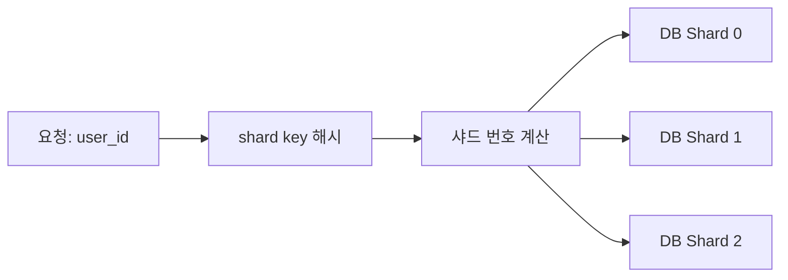

# Sharding과 Partitioning

- **Partitioning**은 하나의 데이터베이스나 테이블을 여러 논리 단위로 나누는 기법이다.
- **Sharding**은 데이터를 여러 데이터베이스 서버에 분산하는 수평 확장 방식이다.
- 좋은 파티션 키는 조회 조건에 자주 사용되고, 데이터가 고르게 분산되며, 변경이 적어야 한다.

## 개념 설명

Partitioning은 보통 한 DB 인스턴스 안에서 데이터를 나눈다. 대표적으로 **Range**, **List**, **Hash partitioning**이 있다. 예를 들어 주문 테이블을 주문일 기준으로 월별 분할하면 오래된 데이터 삭제와 기간 조회가 쉬워진다. DB가 파티션을 먼저 선택하는 **partition pruning**을 수행하므로 불필요한 데이터 스캔도 줄어든다.

Sharding은 여러 DB 서버에 데이터를 배치한다. 애플리케이션 또는 프록시가 `shard key`를 이용해 어느 서버로 요청을 보낼지 결정한다. 사용자 ID를 해시하여 샤드를 선택하면 데이터가 비교적 균등하게 분산된다. 반면 특정 지역이나 날짜처럼 범위 기반 키는 범위 조회에 유리하지만, 최근 데이터에 요청이 몰리는 **hot shard**가 생길 수 있다.

샤드 키는 신중하게 선택해야 한다. 자주 함께 조회되는 데이터가 다른 샤드에 있으면 cross-shard join, 분산 트랜잭션, 결과 병합이 필요해진다. 샤드 추가 시 기존 데이터를 재배치하는 rebalancing 비용도 고려해야 한다. 해시 모듈로 직접 샤드를 계산하면 서버 수 변경 시 대부분의 데이터가 이동하므로, 실무에서는 consistent hashing이나 가상 샤드(virtual shard)를 사용한다.

## 코드 예제

```sql
CREATE TABLE orders (
  id BIGINT,
  user_id BIGINT,
  ordered_at DATE,
  amount DECIMAL(12,2)
) PARTITION BY RANGE (ordered_at);

CREATE TABLE orders_2025_01
  PARTITION OF orders
  FOR VALUES FROM ('2025-01-01') TO ('2025-02-01');

-- 애플리케이션의 간단한 샤드 라우팅
shard_no = hash(user_id) % SHARD_COUNT
db = shard_pool[shard_no]
db.query("SELECT * FROM orders WHERE user_id = ?", user_id)
```

## 동작 흐름



## 면접 질문

### 1. Partitioning과 Sharding의 차이는?

Partitioning은 주로 하나의 DB 내부에서 테이블을 논리적으로 나누는 방식이다. Sharding은 여러 DB 서버에 데이터를 분산하여 저장하고 처리량과 저장 용량을 수평 확장하는 방식이다.

### 2. 샤드 키를 잘못 선택하면 어떤 문제가 생기는가?

데이터가 특정 샤드에 집중되는 hot shard, 샤드 간 join 증가, 재배치 비용, 조회 라우팅 복잡도가 발생한다. 따라서 분산 균등성뿐 아니라 주요 조회 패턴과 데이터 변경 가능성도 함께 검토해야 한다.

> **한 줄 정리:** Partitioning은 데이터를 나누어 관리 효율과 조회 성능을 높이고, Sharding은 여러 서버로 분산해 수평 확장한다.
