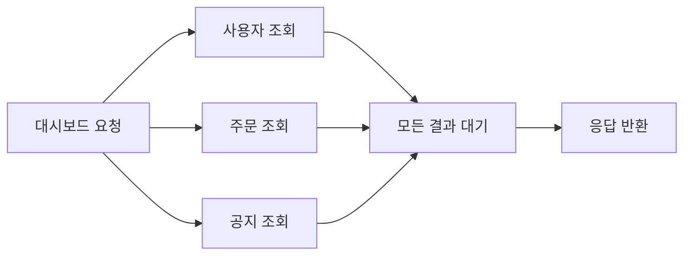

# 동기 실행과 비동기 실행: 성능 최적화 관점

- **동기 실행**은 이전 작업이 끝날 때까지 다음 작업이 대기하므로 흐름이 단순하지만, I/O 대기 시간이 전체 처리 시간을 막을 수 있다.
- **비동기 실행**은 대기 중인 작업을 다른 작업과 겹쳐 실행해 처리량과 자원 활용률을 높일 수 있지만, 동시성 제어와 오류 처리가 복잡해진다.
- 최적화의 핵심은 “무조건 비동기”가 아니라 **작업 종류, 의존성, 동시성 수준, 측정 결과**에 맞게 선택하는 것이다.

## 개념 설명

동기 실행에서는 호출한 함수가 반환될 때까지 현재 흐름이 멈춘다. 파일 읽기, 네트워크 요청, 데이터베이스 쿼리처럼 완료까지 시간이 필요한 작업이 여러 개라면 대기 시간이 순차적으로 누적된다. 반면 비동기 실행은 작업을 시작한 뒤 완료를 기다리는 동안 다른 작업을 처리한다. 따라서 서로 의존하지 않는 I/O 작업은 동시에 시작하면 전체 지연 시간을 줄일 수 있다.

예를 들어 네트워크 요청 세 개의 시간이 각각 100ms라면 순차 동기는 약 300ms가 걸릴 수 있지만, 병렬 비동기는 약 100ms에 가까워질 수 있다. 단, 서버의 연결 수, API 제한, CPU와 메모리 사용량에 따라 실제 성능은 달라진다. 동시 요청을 무제한으로 늘리면 스레드 고갈, 커넥션 풀 고갈, 큐 폭증, 외부 서비스 장애를 유발할 수 있으므로 **동시성 제한과 타임아웃, 재시도, 취소, 백프레셔**가 필요하다.

CPU 집약 작업은 비동기 문법만 사용한다고 빨라지지 않는다. 자바스크립트의 단일 이벤트 루프에서 무거운 계산을 수행하면 다른 요청까지 막히므로 워커, 프로세스 분산, SIMD 또는 알고리즘 개선을 고려해야 한다. 또한 비동기화에는 컨텍스트 전환과 스케줄링 비용이 있으므로 짧은 작업까지 과도하게 쪼개지 않는다. 최적화 전후의 p95/p99 지연 시간, 처리량, CPU·메모리 사용량을 측정해 판단해야 한다.

## 코드 예시

```javascript
async function loadDashboard() {
  const [user, orders, notices] = await Promise.all([
    fetch("/user").then(r => r.json()),
    fetch("/orders").then(r => r.json()),
    fetch("/notices").then(r => r.json())
  ]);
  return { user, orders, notices };
}
```

## 실행 흐름



## 면접 질문

### 1. 비동기 실행이 항상 성능을 개선하나요?

아니다. 독립적인 I/O 작업에는 효과적이지만 CPU 집약 작업에는 별도 실행 자원이 필요하다. 또한 동시성 증가로 커넥션 고갈이나 외부 시스템 과부하가 발생할 수 있어 측정과 제한이 필수다.

### 2. `Promise.all` 사용 시 주의할 점은 무엇인가요?

모든 작업을 동시에 시작하므로 독립 작업에 적합하다. 하나라도 실패하면 전체가 즉시 실패하며, 요청 수가 많으면 동시성 제한을 적용해야 한다. 일부 실패를 허용하려면 `Promise.allSettled`를 검토한다.

> **한 줄 정리:** 성능 최적화에서 비동기는 대기 시간을 겹치는 도구이며, 작업 특성과 시스템 한계를 측정해 적절한 동시성으로 사용해야 한다.
