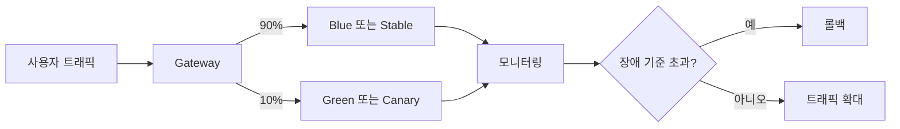

# Blue-Green 및 Canary 배포

- **Blue-Green 배포**: 동일한 운영 환경을 두 개 구성하고 트래픽을 한 번에 전환하여 빠른 롤백을 지원한다.
- **Canary 배포**: 일부 사용자·트래픽에만 새 버전을 점진적으로 노출하여 장애 범위를 제한한다.
- 두 전략 모두 배포 자체보다 **헬스 체크, 모니터링, 롤백 기준, 데이터베이스 호환성**이 성공을 좌우한다.

## 개념 설명

### Blue-Green 배포

Blue와 Green이라는 동일한 인프라를 준비한다. 현재 서비스가 Blue에서 실행 중이라면 Green에 새 버전을 배포하고 테스트한다. 검증이 끝나면 로드밸런서나 서비스 디스커버리의 라우팅 대상을 Green으로 변경한다.

장점은 전환이 단순하고 전체 트래픽을 빠르게 되돌릴 수 있다는 점이다. 반면 두 환경을 동시에 유지해야 하므로 비용이 증가하며, 전환 순간의 호환성 문제가 발생할 수 있다. 특히 기존 버전이 처리 중인 요청, 세션 저장소, 캐시, DB 스키마를 고려해야 한다.

### Canary 배포

새 버전을 소수의 트래픽에 먼저 연결한다. 예를 들어 1% → 10% → 50% → 100%로 비율을 늘리며 오류율, 지연 시간, CPU 사용률, 비즈니스 지표를 비교한다. 문제가 발생하면 새 버전으로 유입되는 트래픽만 차단한다.

실제 사용자 환경에서 검증할 수 있고 비용을 점진적으로 사용할 수 있다. 그러나 트래픽 분배와 관찰이 복잡하며, 일부 사용자만 실패하는 기능·지역·디바이스별 문제를 놓칠 수 있다. 자동 롤백을 위해 명확한 SLO와 임계값을 정의해야 한다.

두 방식 모두 DB 변경은 **하위 호환**을 우선한다. 먼저 새 컬럼을 추가하고 양쪽 버전이 동작하도록 만든 뒤, 애플리케이션 전환 후 사용하지 않는 컬럼을 제거하는 식의 점진적 마이그레이션이 안전하다.

## 간단한 Canary 라우팅 예시

```yaml
apiVersion: networking.istio.io/v1beta1
kind: VirtualService
spec:
  hosts: ["api.example.com"]
  http:
  - route:
    - destination: {host: api, subset: stable}
      weight: 90
    - destination: {host: api, subset: canary}
      weight: 10
```



## 면접 질문

### 1. Blue-Green과 Canary의 차이는 무엇인가요?

Blue-Green은 새 환경으로 트래픽을 거의 한 번에 전환하는 방식이라 배포와 롤백이 빠르다. Canary는 일부 트래픽만 먼저 전환해 위험을 점진적으로 검증한다. 따라서 전자는 환경 비용과 전환 리스크가 크고, 후자는 운영 복잡도와 관찰 비용이 크다.

### 2. 배포 후 어떤 기준으로 자동 롤백하나요?

HTTP 5xx 비율, p95·p99 지연 시간, 상태 체크 실패율, 자원 사용량, 핵심 비즈니스 오류율을 기존 버전과 비교한다. 일정 시간 동안 임계값을 초과하면 트래픽을 이전 버전으로 되돌리며, 단일 지표가 아닌 여러 지표와 최소 관찰 시간을 함께 사용해야 한다.

## 한 줄 정리

**Blue-Green은 빠른 전환과 롤백에, Canary는 점진적 위험 검증에 적합하며, 둘 다 관찰 가능성과 하위 호환 설계가 핵심이다.**
