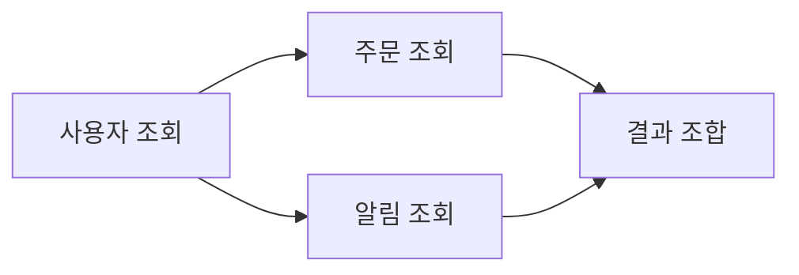

# 동기 실행과 비동기 실행: 성능 최적화 관점

- **동기 실행**은 작업이 끝날 때까지 다음 작업이 대기하므로 흐름이 단순하지만, I/O 대기 시간이 전체 응답 시간을 늘릴 수 있다.
- **비동기 실행**은 대기 중인 작업을 다른 작업과 겹쳐 처리해 I/O 중심 시스템의 처리량과 자원 활용률을 높인다.
- 비동기가 항상 빠른 것은 아니다. CPU 연산에는 병렬 처리, 작업 분할, 워커 활용이 필요하며 과도한 동시성은 메모리와 연결 풀 고갈을 일으킨다.

## 개념 설명

동기 실행은 호출한 작업이 완료된 뒤 다음 코드가 실행되는 방식이다. 데이터베이스 조회, 파일 읽기, HTTP 요청처럼 외부 자원을 기다리는 동안 현재 스레드가 멈추면 CPU가 유휴 상태가 될 수 있다. 특히 요청 처리 스레드가 블로킹되면 동시 사용자 수가 증가할 때 응답 지연과 스레드 고갈이 발생한다.

비동기 실행은 작업을 시작한 뒤 완료를 기다리는 동안 다른 작업을 진행하고, 완료 시 콜백·Promise·이벤트 등으로 결과를 처리한다. 따라서 네트워크나 디스크처럼 대기 시간이 긴 작업을 겹칠 수 있다. 여러 독립적인 I/O는 순차 실행보다 병렬적으로 시작하는 편이 총 지연 시간을 줄인다. 단, 비동기는 실행 순서를 자동으로 보장하지 않으므로 의존성이 있는 작업은 `await`로 순서를 명확히 해야 한다.

성능 최적화에서는 평균 시간뿐 아니라 p95/p99 지연 시간, 처리량, CPU·메모리 사용량을 함께 측정해야 한다. CPU 중심 작업은 비동기 문법만으로 빨라지지 않으며, 이벤트 루프를 오래 점유하면 다른 요청까지 지연된다. 이때 워커 스레드, 프로세스 분산, 배치 처리 등을 고려한다. 또한 무제한 `Promise.all`은 외부 API 제한과 커넥션 풀을 초과할 수 있으므로 동시성 제한, 타임아웃, 재시도, 취소와 백프레셔를 적용해야 한다.

## 코드 예시

```javascript
async function loadDashboard(userId) {
  const user = await getUser(userId); // 의존 관계
  const [orders, alerts] = await Promise.all([
    getOrders(user.id),               // 독립 I/O
    getAlerts(user.id)
  ]);
  return { user, orders, alerts };
}
```

위 코드는 사용자 조회 후 주문과 알림을 동시에 시작한다. 두 작업이 독립적이므로 순차 실행보다 대기 시간을 줄일 수 있다. 다만 동시 호출 수가 많다면 세마포어 등으로 실행 개수를 제한해야 한다.



## 면접 질문

### 1. 비동기 실행은 항상 성능을 향상시키는가?

아니다. I/O 대기에는 효과적이지만 CPU 연산 자체를 줄이지는 않는다. 오히려 컨텍스트 전환, 스케줄링, 동기화 비용이 추가될 수 있으며, 과도한 동시성은 자원 경합과 장애를 유발한다.

### 2. `Promise.all`을 사용할 때 주의할 점은?

모든 작업을 동시에 실행하므로 독립 작업의 지연 시간은 줄일 수 있지만, 실패 시 전체 Promise가 실패하고 요청 수가 폭증할 수 있다. 타임아웃, 부분 실패 처리, 동시성 제한, 외부 시스템의 rate limit을 함께 고려해야 한다.

> **한 줄 정리:** I/O는 비동기로 겹치고, CPU는 병렬화하며, 동시성은 자원 한도 안에서 측정 기반으로 조절하라.
