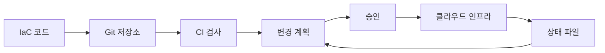

# Infrastructure as Code란?

- 인프라를 클릭으로 만들지 않고 **코드로 정의하고 자동 생성**하는 방식이다.
- 서버, 네트워크, 데이터베이스 설정을 **버전 관리하고 반복 재현**할 수 있다.
- 대표 도구로 Terraform, AWS CloudFormation, Pulumi, Ansible 등이 있다.

## 개념 설명

Infrastructure as Code(IaC)는 인프라를 요리 레시피처럼 다루는 방법이다.  
요리할 때마다 재료와 순서를 기억해 직접 만들면 결과가 달라질 수 있다. 반면 레시피를 작성해 두면 누구나 같은 방식으로 같은 요리를 만들 수 있다. IaC에서 코드가 레시피이고, 클라우드 서버와 네트워크가 요리 결과다.

콘솔에서 서버를 직접 생성하면 누가 언제 어떤 옵션을 바꿨는지 추적하기 어렵다. IaC는 인프라 상태를 코드 파일에 기록하므로 Git으로 변경 이력을 확인하고 코드 리뷰를 할 수 있다. 개발, 스테이징, 운영 환경도 변수만 바꿔 비슷한 구조로 만들 수 있다.

일반적인 흐름은 다음과 같다. 개발자가 원하는 상태를 코드로 선언하고, 도구가 현재 인프라와 비교한 뒤 필요한 생성·수정·삭제 작업을 계산한다. 이후 승인된 변경 계획을 클라우드에 적용한다. 이를 선언적 방식이라고 하며, “서버를 한 대 만들고 설정 파일을 복사하라”보다 “웹 서버가 세 대인 상태를 유지하라”에 가깝다.

장점은 재현성, 자동화, 감사 가능성이다. 단, 상태 파일에 비밀번호를 저장하거나 무분별하게 `apply`하면 보안 사고와 장애가 발생할 수 있다. 상태 파일은 안전한 원격 저장소에 보관하고, 변경 전 계획 검토와 CI 검사를 적용하는 것이 좋다.

## 코드 예시: Terraform

```hcl
terraform {
  required_providers {
    aws = {
      source  = "hashicorp/aws"
      version = "~> 5.0"
    }
  }
}

provider "aws" {
  region = "ap-northeast-2"
}

resource "aws_s3_bucket" "logs" {
  bucket = "company-example-logs"
}
```

`terraform plan`은 실제 변경 전에 실행 계획을 보여 주고, `terraform apply`는 그 계획을 적용한다. 팀에서는 코드 리뷰 후 적용하도록 파이프라인을 구성한다.

## 동작 흐름



## 면접 질문

### 1. IaC의 선언적 방식과 명령형 방식의 차이는 무엇인가요?

선언적 방식은 원하는 최종 상태를 정의하고 도구가 변경 과정을 계산한다. 명령형 방식은 실행할 명령의 순서를 직접 작성한다. 선언적 방식은 현재 상태와 목표 상태를 비교하므로 반복 실행과 환경 재현에 유리하다.

### 2. Terraform 상태 파일은 왜 중요하며 어떻게 보호하나요?

상태 파일은 코드와 실제 클라우드 리소스의 연결 정보를 저장한다. 여러 사람이 사용하면 원격 백엔드와 잠금 기능을 사용하고, 접근 권한을 최소화한다. 비밀번호 같은 민감 정보는 상태 파일과 코드에 직접 넣지 않는다.

## 한 줄 정리

**IaC는 인프라를 클릭 작업이 아닌 검토·재현 가능한 코드로 관리하는 방법이다.**
