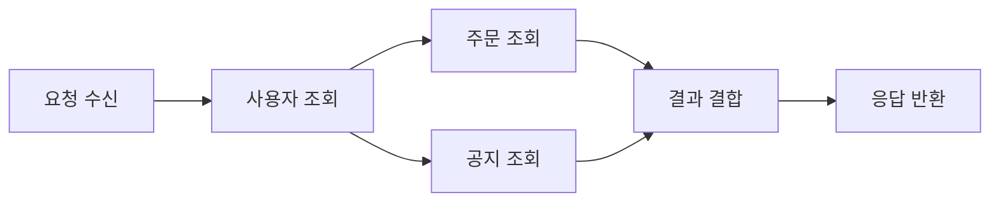

# 동기 실행 vs 비동기 실행: 성능 최적화 관점

- **동기 실행**은 작업이 끝날 때까지 다음 코드가 기다리므로 흐름이 단순하지만, I/O 대기 시간이 전체 처리 시간을 막을 수 있다.
- **비동기 실행**은 대기 중 다른 작업을 처리해 동시성을 높이지만, 콜백·Promise·스케줄링 오버헤드와 복잡성이 발생한다.
- 성능 최적화의 핵심은 “무조건 비동기”가 아니라 **작업 종류, 동시성 수준, 자원 한계, 응답 지연시간**에 맞는 방식을 선택하는 것이다.

## 개념 설명

동기 실행에서는 호출한 작업이 완료된 뒤 다음 단계로 진행한다. 데이터베이스 조회, 파일 읽기, 네트워크 요청처럼 결과를 기다려야 하는 I/O 작업이 동기 방식으로 실행되면 스레드나 프로세스가 대기 상태가 된다. 요청이 적으면 구현이 단순하다는 장점이 있지만, 대기 시간이 누적되어 처리량이 감소한다.

비동기 실행에서는 I/O 요청을 시작한 뒤 완료를 기다리는 동안 다른 작업을 수행한다. 이벤트 루프, 콜백, Promise, `async/await` 등이 대표적인 모델이다. 단, `async/await`는 문법을 간결하게 만들 뿐 작업 자체를 자동으로 병렬 실행하지 않는다. 독립적인 작업은 동시에 시작해야 한다.

CPU 연산은 비동기로 감싸도 계산 시간이 사라지지 않는다. 이벤트 루프 기반 환경에서는 무거운 CPU 작업이 이벤트 루프를 점유해 모든 요청의 지연시간을 증가시킬 수 있으므로 워커 스레드, 프로세스 분리, 작업 큐를 고려해야 한다.

성능 측정 시 평균 시간만 보지 말고 p95·p99 지연시간, 처리량, CPU·메모리 사용량, 외부 시스템의 연결 수를 함께 확인한다. `Promise.all`로 동시성을 높이면 빠를 수 있지만, 요청 폭증과 커넥션 고갈을 유발할 수 있다. 따라서 동시성 제한, 타임아웃, 재시도, 취소, 백프레셔를 함께 설계해야 한다.

## 코드 예시

```javascript
async function loadDashboard(userId) {
  const user = await getUser(userId);
  const [orders, notices] = await Promise.all([
    getOrders(user.id),
    getNotices()
  ]);
  return { user, orders, notices };
}
```

위 코드에서 사용자 정보는 주문 조회의 입력이므로 순차 실행한다. 반면 주문과 공지는 서로 독립적이므로 동시에 시작해 총 대기시간을 줄인다. 단, 실제 서비스에서는 동시 요청 수를 제한해야 한다.

## 실행 흐름



## 면접 질문

### 1. `async/await`를 사용하면 작업이 병렬로 실행되나요?

아니다. `await`를 연속으로 사용하면 순차 실행된다. 서로 독립적인 작업은 `Promise.all` 등으로 함께 시작해야 한다.

### 2. 비동기 방식이 항상 성능이 좋은가요?

아니다. I/O 대기에는 효과적이지만 CPU 중심 작업에는 효과가 제한적이다. 과도한 동시성은 메모리, 연결 풀, 외부 API를 고갈시킬 수 있으므로 측정과 제한이 필요하다.

> **한 줄 정리:** 비동기 최적화는 대기 시간을 겹치는 기술이며, 실제 성능은 작업 특성과 적절한 동시성 제어가 결정한다.
