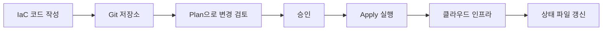

# Infrastructure as Code란?

## 핵심 포인트

- 인프라를 콘솔에서 수동 설정하지 않고 **코드로 정의하고 관리**한다.
- 같은 코드를 실행하면 개발·스테이징·운영 환경을 **일관되게 재현**할 수 있다.
- 변경 이력이 남아 협업, 리뷰, 자동화, 장애 복구가 쉬워진다.

## 개념 설명

Infrastructure as Code, 줄여서 IaC는 서버, 네트워크, 데이터베이스, 권한 같은 인프라를 코드 파일로 표현하는 방식이다. 예를 들어 AWS 콘솔에서 버튼을 눌러 EC2를 만들 수도 있지만, IaC에서는 “어떤 이미지로 몇 대를 만들고, 어떤 네트워크와 보안 그룹을 사용할지”를 파일에 작성한다.

초보자에게는 **레시피와 요리**에 비유할 수 있다. 매번 요리사가 기억에 의존해 재료를 준비하면 맛과 양이 달라질 수 있다. 반면 레시피를 코드로 작성하면 누구나 같은 절차로 같은 요리를 만들 수 있다. 인프라 코드가 바로 서버 환경을 만드는 레시피다.

대표적인 도구로 Terraform, AWS CloudFormation, Pulumi, Ansible이 있다. Terraform은 여러 클라우드에서 사용할 수 있고, 원하는 최종 상태를 선언적으로 작성한다. 사용자는 “서버를 어떤 순서로 직접 만들지”보다 “최종적으로 어떤 인프라가 존재해야 하는지”에 집중한다.

일반적인 흐름은 코드 작성, 변경 계획 확인, 실제 적용 순서다. 적용 전에 계획을 확인하면 실수로 데이터베이스를 삭제하거나 보안 그룹을 공개하는 문제를 줄일 수 있다. 코드는 Git으로 관리하므로 Pull Request 리뷰와 승인 절차도 적용할 수 있다.

IaC의 핵심은 멱등성이다. 같은 코드를 여러 번 적용해도 이미 원하는 상태라면 불필요한 리소스를 계속 만들지 않아야 한다. 또한 비밀번호나 API 키를 코드에 직접 넣지 말고 Secret Manager, 환경 변수, CI/CD의 보안 저장소를 사용해야 한다. 상태 파일에도 민감 정보가 포함될 수 있으므로 접근 권한과 저장 위치를 보호해야 한다.

## 코드 예시

```hcl
terraform {
  required_providers {
    aws = { source = "hashicorp/aws", version = "~> 5.0" }
  }
}

provider "aws" {
  region = "ap-northeast-2"
}

resource "aws_s3_bucket" "logs" {
  bucket = "example-company-logs"
}

resource "aws_s3_bucket_versioning" "logs" {
  bucket = aws_s3_bucket.logs.id
  versioning_configuration { status = "Enabled" }
}
```

## 동작 흐름



## 면접 질문

### 1. IaC를 사용하는 이유는 무엇인가요?

인프라 구성을 코드로 표준화해 환경 차이와 수동 작업 실수를 줄이고, Git을 통한 변경 이력·리뷰·자동 배포·복구를 가능하게 하기 위해 사용합니다.

### 2. Terraform의 `plan`과 `apply`의 차이는 무엇인가요?

`plan`은 현재 상태와 코드의 차이를 계산해 예상 변경 사항을 보여주고, `apply`는 그 변경 사항을 실제 클라우드에 반영합니다.

## 한 줄 정리

**IaC는 인프라를 사람이 기억해서 만드는 대신, 누구나 반복 실행할 수 있는 코드 레시피로 관리하는 방법이다.**
