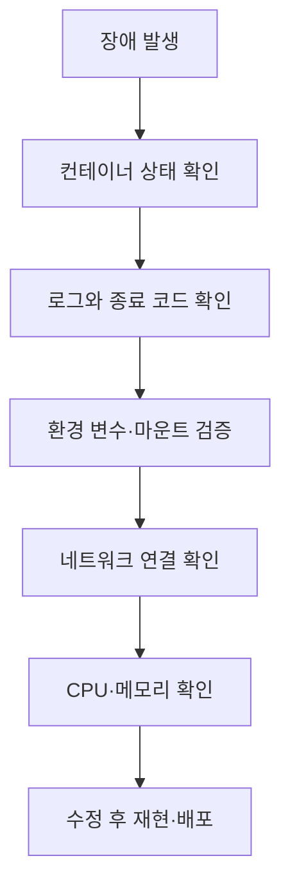

# 컨테이너화(Containerization)와 실무 트러블슈팅

## 핵심 포인트

- **이미지와 컨테이너를 구분하라:** 이미지는 실행에 필요한 파일 시스템·메타데이터의 불변 템플릿이고, 컨테이너는 이를 실행한 프로세스다.
- **문제는 프로세스·자원·네트워크·스토리지로 분해하라:** “컨테이너가 안 된다”는 현상을 로그, 상태, 리소스, 연결 경로별로 좁혀야 한다.
- **재현성과 관찰 가능성이 운영 품질을 결정한다:** 고정된 이미지 태그, 명시적 환경 변수, 헬스체크, 구조화 로그를 기본값으로 둔다.

## 개념 설명

컨테이너는 호스트 OS의 커널을 공유하면서 프로세스를 격리한다. Linux의 namespace는 프로세스 ID, 네트워크, 마운트 등을 분리하고, cgroup은 CPU·메모리 같은 자원을 제한한다. 따라서 VM보다 가볍지만, 별도의 커널을 가진 완전한 가상 머신은 아니다.

실무에서는 먼저 **상태와 종료 원인**을 확인한다. `docker ps -a`로 종료 여부를 보고, `docker logs`로 애플리케이션 로그를 확인하며, `docker inspect`로 환경 변수·마운트·네트워크 설정을 검증한다. 프로세스가 즉시 종료되면 애플리케이션이 PID 1로 실행되는지, foreground로 동작하는지, 필요한 환경 변수가 있는지 확인한다.

메모리 초과는 `OOMKilled`, 종료 코드 137로 나타날 수 있다. CPU 부족은 느린 응답과 health check 실패로 이어진다. 컨테이너 내부의 `localhost`는 호스트나 다른 컨테이너가 아니라 **자기 자신**을 가리킨다. 컨테이너 간 통신은 서비스명과 컨테이너 포트를 사용해야 하며, 외부 공개에는 호스트 포트 매핑이 필요하다.

데이터베이스나 업로드 파일을 컨테이너 계층에만 저장하면 컨테이너 삭제 시 사라진다. 영속 데이터는 named volume 또는 외부 스토리지에 둔다. 또한 `latest` 태그 대신 버전 또는 digest를 고정해야 배포 결과를 재현할 수 있다. 운영 장애 시 무작정 재시작하기보다 로그, inspect 결과, 리소스 상태, 최근 이미지 변경을 함께 보존하는 것이 중요하다.

## 실무 점검 예시

```bash
docker ps -a
docker logs --tail=200 app
docker inspect app
docker stats app
docker exec -it app sh
docker port app
docker network inspect app-net
docker image inspect myapp:1.4.2
docker run --rm --env-file .env myapp:1.4.2
```

## 트러블슈팅 흐름



## 면접 질문

### 1. 컨테이너와 가상 머신의 차이는?

컨테이너는 호스트 커널을 공유하고 프로세스를 격리하므로 빠르고 가볍다. VM은 게스트 OS와 커널을 포함해 격리 수준은 높지만 상대적으로 무겁다.

### 2. 컨테이너가 실행 직후 종료되는 원인은?

주 프로세스가 종료되었거나 foreground 실행이 아니기 때문이다. `docker logs`, 종료 코드, entrypoint와 CMD, 필수 환경 변수 및 파일 권한을 확인한다.

## 한 줄 정리

**컨테이너 장애는 이미지, 프로세스, 자원, 네트워크, 스토리지를 분리해 관찰하면 빠르게 원인을 좁힐 수 있다.**
