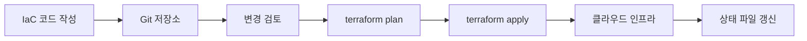

# Infrastructure as Code(IaC)

- 인프라를 수동으로 만들지 않고 **코드로 정의하고 자동 생성**한다.
- 서버, 네트워크, 데이터베이스 설정을 **버전 관리하고 반복 재현**할 수 있다.
- Terraform, AWS CloudFormation, Pulumi, Ansible 등이 대표적인 도구다.

## 개념 설명

IaC는 인프라스트럭처 애즈 코드(Infrastructure as Code)의 약자다. 서버를 만들 때 콘솔에서 버튼을 하나씩 누르는 대신, 원하는 상태를 코드로 작성하고 도구가 실제 환경을 구성하게 한다.

초보자에게는 **레시피로 요리하는 것**에 비유할 수 있다. 매번 요리사가 기억에 의존해 재료를 준비하면 양이나 순서가 달라질 수 있다. 하지만 레시피에 재료와 조리법을 적어 두면 누구나 같은 결과를 만들 수 있다. IaC 코드가 레시피이고, 클라우드 인프라가 완성된 요리다.

예를 들어 “웹 서버 2대, 특정 네트워크, 보안 규칙”을 코드로 정의하면 개발 환경, 테스트 환경, 운영 환경에 동일한 구조를 만들 수 있다. 코드가 Git으로 관리되므로 누가 언제 어떤 설정을 변경했는지 추적할 수 있고, 리뷰와 승인 절차도 적용할 수 있다.

IaC는 보통 **선언적 방식**을 사용한다. “서버를 생성한 뒤 보안 그룹을 연결하라”처럼 절차를 직접 지시하기보다, “최종적으로 서버와 보안 그룹이 존재해야 한다”라고 원하는 상태를 선언한다. Terraform 같은 도구는 현재 상태와 목표 상태를 비교해 필요한 변경만 수행한다.

핵심 장점은 일관성, 자동화, 재현성이다. 반면 상태 파일 관리, 비밀 정보 노출, 잘못된 변경으로 인한 대규모 장애에는 주의해야 한다. 상태 파일은 원격 저장소에 안전하게 보관하고, 변경 전 계획 결과를 검토하는 습관이 중요하다.

## 코드 예시

```hcl
provider "aws" {
  region = "ap-northeast-2"
}

resource "aws_instance" "web" {
  ami           = "ami-xxxxxxxx"
  instance_type = "t3.micro"

  tags = {
    Name = "web-server"
  }
}
```

`terraform plan`으로 변경 예정 내용을 먼저 확인하고, `terraform apply`로 실제 인프라에 반영한다. 실무에서는 코드 리뷰와 CI/CD 파이프라인을 통해 자동 검증과 배포를 수행한다.

## 동작 흐름



## 면접 질문

### 1. IaC의 장점은 무엇인가요?

인프라를 코드로 관리해 환경을 일관되게 재현할 수 있고, Git을 이용한 변경 이력 관리와 코드 리뷰, 자동 배포가 가능하다. 수동 작업을 줄여 설정 오류도 감소한다.

### 2. 선언적 IaC와 명령형 방식의 차이는 무엇인가요?

선언적 방식은 “최종적으로 어떤 상태가 되어야 하는가”를 정의하고 도구가 변경 과정을 결정한다. 명령형 방식은 “어떤 순서로 무엇을 실행할지”를 직접 작성한다. Terraform은 대표적인 선언적 도구다.

## 한 줄 정리

**IaC는 인프라를 사람이 반복 작업하는 대상에서, 버전 관리 가능한 코드와 자동화의 대상으로 바꾸는 방법이다.**
