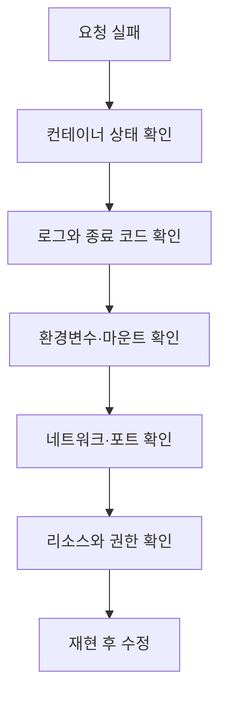

# 컨테이너화: 실무 트러블슈팅 중심 정리

## 핵심 포인트

- 컨테이너는 가상머신보다 가볍지만, **커널·네트워크·파일시스템·권한을 호스트와 공유**하므로 격리 수준을 정확히 이해해야 한다.
- 장애의 대부분은 이미지 자체보다 **환경변수, 볼륨 마운트, 포트, DNS, 권한, 메모리 제한**에서 발생한다.
- 문제를 감으로 수정하지 말고 `logs → inspect → exec → 리소스 확인` 순서로 **관찰 가능한 정보부터 수집**한다.

## 개념 설명

컨테이너는 애플리케이션과 실행 의존성을 이미지로 패키징하고, 호스트 OS의 커널을 공유한 채 프로세스를 격리 실행하는 기술이다. 이미지가 변경 불가능한 레이어들의 집합이라면, 컨테이너는 그 이미지 위에 생성되는 실행 인스턴스다. 따라서 컨테이너 내부 파일을 직접 수정해도 컨테이너를 삭제하면 사라진다. DB 데이터나 업로드 파일은 반드시 볼륨 또는 외부 스토리지에 저장해야 한다.

실무에서 먼저 확인할 것은 컨테이너가 “실행 중”인지가 아니라 애플리케이션이 “정상 서비스 중”인지다. 프로세스가 살아 있어도 잘못된 포트 바인딩, 헬스체크 실패, 의존 서비스 연결 실패가 발생할 수 있다. `docker logs`로 시작 실패와 환경변수 오류를 확인하고, `docker inspect`로 실제 환경변수·마운트·네트워크·종료 코드를 확인한다. 컨테이너 내부에서 DNS나 파일 권한을 확인할 때는 `docker exec`를 사용한다.

자주 발생하는 원인은 호스트와 컨테이너의 경로 혼동, 컨테이너 포트와 호스트 포트 혼동, 실행 사용자 UID 불일치다. `OOMKilled`라면 애플리케이션 버그뿐 아니라 컨테이너 메모리 제한과 JVM·Node.js 힙 설정도 함께 확인해야 한다. ARM과 x86 환경 차이로 이미지가 실행되지 않으면 멀티 아키텍처 이미지인지 확인한다. 운영에서는 태그를 `latest`에 고정하지 말고 버전 또는 다이제스트를 사용해 재현성을 확보한다.

## 실무 점검 예시

```bash
docker ps -a
docker logs --tail=200 app
docker inspect app
docker exec -it app sh
docker stats app
docker port app
docker network inspect app-net
docker volume inspect app-data
docker run --rm --env-file .env image:1.2.3
```

## 장애 흐름



## 면접 질문

### 1. 컨테이너와 가상머신의 차이는?

컨테이너는 호스트 커널을 공유하고 프로세스 단위로 격리되어 빠르고 가볍다. 가상머신은 게스트 OS까지 포함해 격리는 강하지만 더 많은 자원을 사용한다.

### 2. 컨테이너가 계속 재시작될 때 어떻게 진단하는가?

`docker ps -a`로 종료 상태와 재시작 횟수를 확인한 뒤, `docker logs`에서 애플리케이션 오류를 찾고 `docker inspect`로 환경변수·마운트·헬스체크·종료 코드를 검증한다.

## 한 줄 정리

컨테이너 장애는 이미지보다 **실행 환경과 외부 의존성의 불일치**를 먼저 의심하고, 관찰 가능한 증거를 순서대로 수집해 해결한다.
