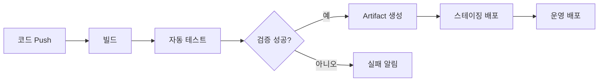

# CI/CD 기초: 자동화된 빌드·테스트·배포

- **CI(Continuous Integration)**: 개발자가 변경 사항을 자주 통합하고, 자동 빌드와 테스트로 오류를 빠르게 발견한다.
- **CD(Continuous Delivery/Deployment)**: 검증된 결과물을 배포 가능한 상태로 유지하거나 운영 환경까지 자동 배포한다.
- 핵심은 **작은 변경, 빠른 피드백, 재현 가능한 파이프라인**이다.

## 개념 설명

CI/CD 파이프라인은 일반적으로 `코드 변경 → 빌드 → 테스트 → 패키징 → 배포` 순서로 동작한다. Git 브랜치에 Pull Request가 생성되면 CI가 실행되어 컴파일 오류, 테스트 실패, 코드 스타일 문제를 검증한다. 이 단계가 통과해야 `main` 브랜치에 병합하도록 설정할 수 있다.

CD는 두 가지 의미로 사용된다. **Continuous Delivery**는 운영 배포 직전까지 자동화하고 실제 배포 승인은 사람이 수행하는 방식이다. **Continuous Deployment**는 모든 검증을 통과한 변경을 운영 환경에 자동 반영한다. 서비스의 위험도와 규제 수준에 따라 둘 중 적절한 방식을 선택한다.

파이프라인은 보통 여러 **job** 또는 **stage**로 나뉜다. 각 단계는 실패 시 다음 단계로 진행하지 않는다. 빌드 결과인 Docker 이미지나 바이너리는 **artifact**로 저장하고, 테스트 환경과 운영 환경에서 동일한 결과물을 사용해야 환경 차이로 인한 장애를 줄일 수 있다.

실무에서는 비밀키를 저장소에 직접 기록하지 않고 CI 플랫폼의 **Secrets**나 외부 Secret Manager를 사용한다. 또한 캐시로 의존성 설치 시간을 줄이고, 병렬 테스트로 피드백 시간을 단축한다. 배포 전 헬스 체크, 롤백 전략, 승인 절차까지 정의해야 안정적인 CD가 된다.

## 코드 예제

다음은 GitHub Actions에서 Node.js 애플리케이션을 테스트하고 Docker 이미지로 빌드하는 예시다.

```yaml
name: CI

on: [push, pull_request]

jobs:
  test-and-build:
    runs-on: ubuntu-latest
    steps:
      - uses: actions/checkout@v4
      - uses: actions/setup-node@v4
        with:
          node-version: 20
          cache: npm
      - run: npm ci
      - run: npm run lint
      - run: npm test -- --runInBand
      - run: docker build -t myapp:${{ github.sha }} .
```

`npm ci`는 lockfile 기준으로 의존성을 설치하므로 재현성이 높다. `github.sha`를 이미지 태그로 사용하면 어떤 커밋이 배포되었는지 추적하기 쉽다. 운영 배포 단계에서는 레지스트리 인증 정보를 Secret으로 주입하고, 테스트 성공 이후에만 실행하도록 job 의존성을 설정한다.



## 면접 질문

### 1. CI와 CD의 차이는 무엇인가요?

CI는 코드 통합 시 빌드와 테스트를 자동화해 결함을 조기에 발견하는 과정이다. CD는 검증된 결과물을 배포 가능한 상태로 만들거나 운영 환경까지 자동 배포하는 과정이다.

### 2. 배포된 버전을 어떻게 추적하고 롤백하나요?

커밋 SHA, Git 태그 또는 빌드 번호를 artifact와 이미지 태그에 포함한다. 장애가 발생하면 이전에 검증된 이미지나 artifact를 다시 배포해 롤백한다.

## 한 줄 정리

**CI/CD는 코드 변경을 빠르고 안전하며 반복 가능하게 빌드·검증·배포하는 자동화 체계다.**
