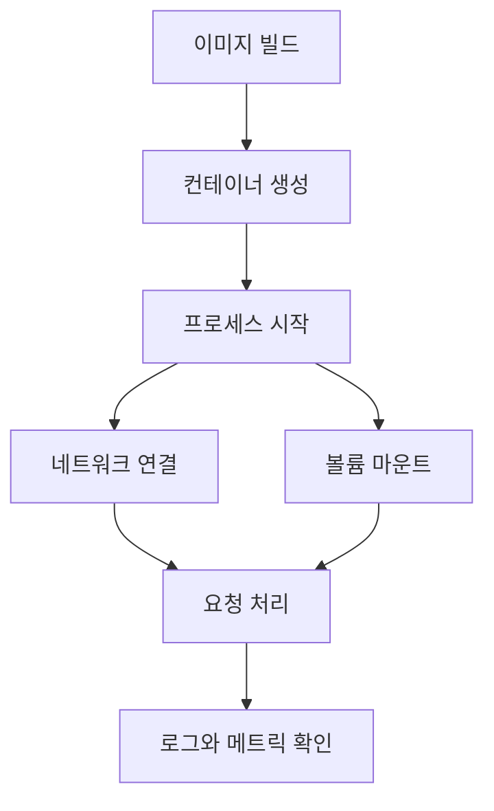

# 컨테이너화(Containerization)와 실무 트러블슈팅

- **컨테이너는 애플리케이션과 실행 환경을 이미지로 패키징**해 어디서나 동일하게 실행한다.
- 장애 원인은 주로 **이미지·프로세스·네트워크·볼륨·리소스 제한**으로 나뉜다.
- 디버깅은 `docker ps → logs/inspect → exec → host와 비교` 순서로 범위를 좁히면 효율적이다.

## 개념 설명

컨테이너는 호스트 OS의 커널을 공유하면서 프로세스를 격리한다. VM처럼 게스트 OS를 포함하지 않으므로 시작이 빠르고 가볍지만, 커널 자체를 격리하는 기술은 아니다. Linux에서는 namespace가 프로세스, 네트워크, 마운트 영역을 분리하고, cgroups가 CPU와 메모리 사용량을 제한한다.

**이미지**는 여러 읽기 전용 레이어의 집합이며, 컨테이너 실행 시 마지막에 쓰기 레이어가 추가된다. 따라서 컨테이너 내부 파일을 수정해도 컨테이너를 삭제하면 사라진다. 데이터베이스 파일이나 업로드 파일은 반드시 볼륨 또는 외부 스토리지에 저장해야 한다. 이미지가 변경되지 않았는데도 결과가 다르면 캐시, 환경 변수, 마운트 경로를 먼저 확인한다.

실무 장애에서는 “컨테이너가 실행 중인가”와 “애플리케이션이 정상인가”를 구분해야 한다. 프로세스가 백그라운드로 분리되거나 PID 1이 즉시 종료되면 컨테이너도 종료된다. `docker ps -a`로 종료 상태와 코드를 확인하고, `docker logs`로 표준 출력 및 표준 에러를 확인한다. 로그가 없다면 로깅 설정, 엔트리포인트, 애플리케이션의 초기화 실패를 점검한다.

네트워크 문제는 컨테이너 내부의 `localhost`가 호스트나 다른 컨테이너를 의미하지 않는다는 점에서 자주 발생한다. 같은 Docker 네트워크에서는 서비스 이름으로 통신하고, 호스트 접근은 환경과 플랫폼에 맞는 주소를 사용해야 한다. 포트 매핑은 `호스트 포트:컨테이너 포트`이며, 애플리케이션이 `127.0.0.1`에만 바인딩되면 외부 요청을 받을 수 없으므로 보통 `0.0.0.0`에 바인딩한다.

메모리 부족은 호스트의 OOM Killer 또는 컨테이너 제한으로 프로세스가 종료되는 원인이다. `docker stats`, 호스트 메트릭, 종료 코드 137을 함께 확인한다. 권한 오류는 호스트 디렉터리의 소유자와 컨테이너 실행 UID가 다를 때 발생하므로, 임시로 root 실행하기보다 올바른 UID, GID와 볼륨 권한을 맞추는 것이 안전하다.

## 실무 점검 예시

```bash
docker ps -a
docker logs --tail 100 app
docker inspect app
docker stats app
docker exec -it app sh
docker exec app env | sort
docker exec app getent hosts db
docker network inspect app-net
docker volume inspect app-data
```

## 실행 흐름



## 면접 질문

### 1. 컨테이너와 VM의 차이는 무엇인가?

VM은 하이퍼바이저 위에서 게스트 OS까지 실행하지만, 컨테이너는 호스트 커널을 공유하고 프로세스만 격리한다. 컨테이너가 더 빠르고 가볍지만 커널 의존성과 격리 수준을 고려해야 한다.

### 2. 컨테이너가 즉시 종료될 때 무엇을 확인하는가?

`docker ps -a`의 종료 코드, `docker logs`, 이미지의 `ENTRYPOINT`와 `CMD`, PID 1 프로세스의 실행 여부를 확인한다. 이후 환경 변수, 파일 권한, 의존 서비스 연결, 메모리 제한을 점검한다.

> **한 줄 정리:** 컨테이너 장애는 격리 경계별로 프로세스, 로그, 네트워크, 저장소, 리소스를 순서대로 검증하라.
