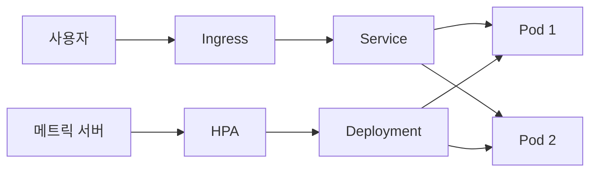

# 컨테이너 오케스트레이션

- 여러 컨테이너의 **배포·확장·복구·네트워킹**을 자동화한다.
- 대표 도구는 Kubernetes이며, AWS ECS/EKS, GCP GKE, Azure AKS처럼 관리형 서비스로도 사용한다.
- 현업에서는 무중단 배포, 트래픽 급증 대응, 장애 컨테이너 자동 재시작에 특히 활용된다.

## 개념 설명

컨테이너 오케스트레이션은 여러 서버에서 실행되는 컨테이너를 원하는 상태로 유지하는 기술이다. 개발자가 “애플리케이션 컨테이너 3개를 실행하고, 외부 요청을 분산하며, 하나가 종료되면 자동으로 교체하라”고 선언하면 오케스트레이터가 현재 상태와 목표 상태를 지속적으로 비교해 조정한다.

Kubernetes에서는 **Pod**가 컨테이너 실행 단위이며, **Deployment**가 Pod의 개수와 버전을 관리한다. **Service**는 고정된 접근 지점과 로드밸런싱을 제공하고, **Ingress**는 도메인·경로 기반 외부 라우팅을 담당한다. CPU나 메모리 사용량에 따라 Pod 수를 늘리는 HPA를 적용하면 수동 증설 없이 피크 트래픽에 대응할 수 있다.

실무 배포에서는 새 버전을 한 번에 교체하지 않고 Rolling Update로 일부 Pod씩 변경한다. 문제가 발생하면 이전 ReplicaSet으로 롤백한다. 헬스 체크인 liveness probe는 비정상 컨테이너 재시작에, readiness probe는 준비되지 않은 인스턴스를 트래픽에서 제외하는 데 사용한다.

다만 모든 시스템에 Kubernetes가 필요한 것은 아니다. 소규모 서비스나 단일 팀 환경에서는 ECS, Docker Compose, 서버리스가 운영 복잡도와 비용 면에서 더 적절할 수 있다. 운영 시에는 리소스 제한, 로그·메트릭 수집, 비밀정보 관리, 노드 장애와 이미지 취약점 대응까지 함께 설계해야 한다.

## 코드 예시

```yaml
apiVersion: apps/v1
kind: Deployment
metadata:
  name: api
spec:
  replicas: 3
  strategy:
    type: RollingUpdate
  selector:
    matchLabels:
      app: api
  template:
    metadata:
      labels:
        app: api
    spec:
      containers:
      - name: api
        image: example/api:2.1
        ports:
        - containerPort: 8080
        readinessProbe:
          httpGet:
            path: /ready
            port: 8080
```

## 배포 흐름



## 면접 질문

### 1. readiness probe와 liveness probe의 차이는?

readiness는 트래픽을 받을 준비가 되었는지 판단해 Service 대상에서 제외한다. liveness는 프로세스가 정상 동작하는지 판단해 실패하면 컨테이너를 재시작한다.

### 2. 컨테이너 오케스트레이션이 필요한 이유는?

컨테이너 수가 늘어날수록 수동 배포, 장애 복구, 로드밸런싱, 스케일링이 복잡해진다. 오케스트레이터는 이를 선언적 설정과 자동 제어로 표준화한다.

> **한 줄 정리:** 컨테이너 오케스트레이션은 분산된 컨테이너를 선언한 상태로 유지해 안정적인 배포와 운영을 가능하게 한다.
