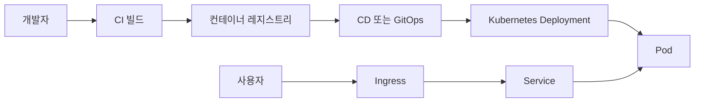

# 컨테이너 오케스트레이션

- 여러 컨테이너의 배포·확장·복구를 자동화하는 운영 기술이며, 대표 도구는 Kubernetes다.
- 현업에서는 무중단 배포, 트래픽 증가 대응, 장애 컨테이너 자동 재시작, 환경 일관성 확보에 활용한다.
- 성공적인 운영에는 애플리케이션 설정뿐 아니라 관측성, 리소스 제한, 보안 정책, 비용 관리가 함께 필요하다.

## 개념 설명

컨테이너 오케스트레이션은 여러 서버에 흩어진 컨테이너의 원하는 상태(desired state)를 선언하고, 실제 상태가 이를 유지하도록 조정하는 시스템이다. Kubernetes에서는 **Pod**가 컨테이너 실행 단위이며, **Deployment**가 복제본 수와 버전 변경을 관리한다. 외부 요청은 **Service**가 안정적인 네트워크 주소로 연결하고, **Ingress**나 Gateway가 도메인·TLS·라우팅을 처리한다.

현업의 일반적인 배포 흐름은 CI가 이미지를 빌드해 레지스트리에 저장하고, CD가 매니페스트를 반영하는 방식이다. Deployment는 새 버전을 점진적으로 배포하며, readiness probe가 통과한 컨테이너에만 트래픽을 전달한다. 오류율이 높으면 이전 버전으로 롤백할 수 있다. HPA는 CPU, 메모리, 요청 수 같은 지표에 따라 Pod 수를 조절해 쇼핑몰 행사나 실시간 서비스의 급격한 부하에 대응한다.

운영에서는 requests와 limits를 설정해 한 서비스가 노드 자원을 독점하지 않도록 하고, 여러 가용 영역에 Pod를 분산해 장애 범위를 줄인다. 또한 로그·메트릭·트레이싱을 중앙화하고, Secret 관리와 RBAC로 접근 권한을 최소화해야 한다. 작은 조직은 관리형 Kubernetes를 사용해 제어 플레인 운영 부담을 줄이고, 무조건 클러스터를 도입하기보다 서비스 수와 배포 빈도에 따라 복잡성과 비용을 판단하는 것이 중요하다.

## 코드 예시

```yaml
apiVersion: apps/v1
kind: Deployment
metadata:
  name: api
spec:
  replicas: 3
  strategy:
    type: RollingUpdate
  selector:
    matchLabels: { app: api }
  template:
    metadata:
      labels: { app: api }
    spec:
      containers:
        - name: api
          image: registry.example.com/api:1.4.0
          ports: [{ containerPort: 8080 }]
          readinessProbe:
            httpGet: { path: /ready, port: 8080 }
          resources:
            requests: { cpu: "200m", memory: "256Mi" }
            limits: { cpu: "1", memory: "512Mi" }
```

## 배포 및 트래픽 흐름



## 면접 질문

### 1. Deployment와 Service의 차이는 무엇인가?

Deployment는 Pod의 배포 버전, 복제본 수, 롤링 업데이트와 복구를 관리한다. Service는 변경되는 Pod를 고정된 주소와 라벨 기반으로 연결해 네트워크 접근을 제공한다.

### 2. readiness probe와 liveness probe의 차이는 무엇인가?

readiness probe는 트래픽을 받아도 되는지 판단하고, 실패하면 Service 대상에서 제외한다. liveness probe는 프로세스가 정상 동작하는지 판단하며, 실패하면 컨테이너를 재시작한다.

> **한 줄 정리:** 컨테이너 오케스트레이션은 컨테이너 실행을 넘어 배포·확장·복구·관측을 자동화하는 운영 플랫폼이다.
