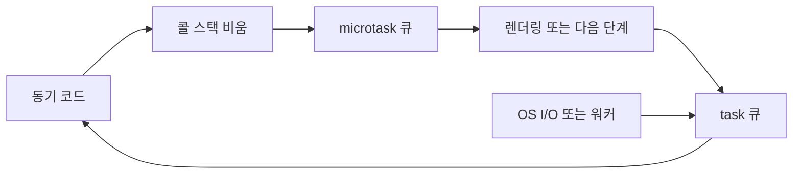

# 이벤트 루프(Event Loop)

- 이벤트 루프는 **단일 JavaScript 실행 스레드**에서 동기 코드와 비동기 작업의 실행 순서를 조정한다.
- 대기 자체를 직접 수행하지 않고, OS의 I/O 준비 통지와 런타임 큐를 이용해 스레드가 놀지 않도록 한다.
- `task`보다 `microtask`가 우선 처리되므로, 마이크로태스크가 과도하면 렌더링이나 다음 이벤트가 지연될 수 있다.

## 개념 설명

JavaScript 엔진의 실행 단위는 콜 스택이다. 함수 호출은 스택 프레임이 되고, 스택이 비어야 이벤트 루프가 다음 작업을 실행할 수 있다. 이벤트 루프 자체는 보통 엔진 외부 런타임이 관리한다. 브라우저에서는 HTML 표준과 브라우저 스케줄러가, Node.js에서는 `libuv`가 핵심 역할을 담당한다.

파일, 네트워크, 타이머 같은 비동기 작업을 호출하면 런타임은 이를 직접 실행 스택에 넣지 않는다. 네트워크는 OS의 `epoll`, `kqueue`, `IOCP` 같은 준비 이벤트 감시기에 등록하고, 일부 파일·암호화 작업은 워커 스레드 풀로 보낸다. 작업이 완료되면 콜백을 큐에 넣고, 이벤트 루프가 콜 스택이 빈 시점에 꺼내 실행한다. 따라서 “비동기”는 JavaScript가 여러 코드를 동시에 실행한다는 뜻이 아니라, 대기 작업을 다른 계층에 위임한다는 의미다.

브라우저의 일반적인 흐름은 task 하나를 실행한 뒤 microtask 큐를 모두 비우고, 필요하면 렌더링한 다음 다음 task를 선택하는 방식이다. `Promise.then`, `queueMicrotask`가 microtask이며, 타이머·클릭·I/O 콜백은 대체로 task다. `process.nextTick`은 Node.js에서 일반 microtask보다도 먼저 처리되는 별도 큐이므로 남용하면 I/O가 굶을 수 있다.

Node.js의 `libuv` 루프는 timers, pending callbacks, poll, check, close callbacks 등의 단계를 순환한다. `setImmediate`는 check 단계와 관련되고, `setTimeout`은 timers 단계에서 만료 여부를 확인한다. 실제 실행 순서는 호출 시점과 I/O 상태에 따라 달라질 수 있으므로 둘의 우선순위를 절대 규칙으로 외우면 안 된다.

## 실행 순서 예시

```js
console.log("A");
setTimeout(() => console.log("timer"), 0);
Promise.resolve().then(() => console.log("promise"));
queueMicrotask(() => console.log("microtask"));
console.log("B");

// A, B, promise, microtask, timer
```

동기 코드가 먼저 끝난 뒤 microtask 큐가 FIFO로 비워지고, 그 다음 timer task가 실행된다. 콜백 내부에서 다시 microtask를 만들면 현재 task가 끝날 때 즉시 처리된다.



## 면접 질문

### 1. `Promise.then`이 `setTimeout(..., 0)`보다 먼저 실행되는 이유는?

`Promise.then`은 microtask 큐에 들어가며, 현재 task가 끝난 직후 다음 task보다 먼저 큐 전체가 처리되기 때문이다. `0ms` 타이머도 즉시 실행이 아니라 최소 지연 후 task 큐에 등록된다.

### 2. 이벤트 루프가 있는데도 화면이나 서버가 멈추는 이유는?

CPU를 많이 사용하는 동기 코드가 콜 스택을 오래 점유하거나, microtask를 계속 생성해 다음 task와 렌더링 기회를 주지 않기 때문이다. 큰 계산은 분할하거나 워커로 이동해야 한다.

> **한 줄 요약:** 이벤트 루프는 콜 스택, 큐, OS·워커의 완료 통지를 연결해 단일 스레드에서 비동기 실행 순서를 관리한다.
