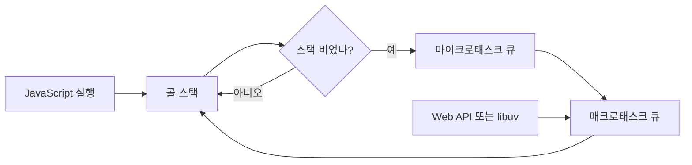

# 이벤트 루프(Event Loop)

- **핵심 1:** 이벤트 루프는 단일 JavaScript 스레드에서 콜 스택과 비동기 작업 큐를 번갈아 처리한다.
- **핵심 2:** I/O 자체를 실행하는 장치가 아니라, 완료된 작업의 콜백을 적절한 시점에 스택으로 이동시키는 스케줄러다.
- **핵심 3:** 마이크로태스크가 매크로태스크보다 우선되므로, 무한한 `Promise` 체인은 타이머와 렌더링을 굶길 수 있다.

## 개념 설명

JavaScript 실행은 기본적으로 하나의 콜 스택에서 진행된다. 함수 호출은 스택 프레임으로 쌓이고, 반환되면 제거된다. 네트워크 요청, 파일 접근, 타이머처럼 오래 걸리는 작업을 스택에서 직접 기다리면 전체 프로그램이 멈추므로, 런타임은 해당 작업을 브라우저의 Web API 또는 Node.js의 `libuv`에 위임한다.

비동기 작업이 완료되면 콜백은 즉시 실행되지 않는다. 완료 결과가 큐에 등록되고 이벤트 루프가 실행 조건을 확인한다. 일반적인 순서는 현재 스택을 비운 뒤 마이크로태스크(`Promise.then`, `queueMicrotask`)를 모두 처리하고, 이후 매크로태스크(`setTimeout`, I/O 콜백 등)를 하나 선택하는 방식이다. 브라우저는 중간에 렌더링 기회를 가질 수 있지만, Node.js는 `libuv`의 단계별 루프를 사용한다.

Node.js의 `libuv` 루프는 대략 `timers → pending callbacks → poll → check → close callbacks` 단계로 순환한다. `poll` 단계에서는 소켓 I/O 완료 이벤트를 확인하고, 작업이 없으면 다음 이벤트나 타이머까지 대기한다. DNS, 파일 시스템, 암호화처럼 OS 비동기 API로 처리하기 어려운 작업은 `libuv` 스레드 풀에서 실행될 수 있다. 따라서 “JavaScript는 싱글 스레드”라는 말은 JS 실행 스레드가 하나라는 뜻이지, 런타임에 스레드가 하나뿐이라는 뜻은 아니다.

큐가 오래 실행되면 이벤트 루프 지연이 발생한다. 특히 큰 동기 계산이나 재귀적인 마이크로태스크는 I/O와 UI 응답을 막는다. 실무에서는 CPU 작업을 작은 단위로 나누거나 Worker, Worker Threads, 별도 프로세스로 분리한다.

```js
console.log("A");

setTimeout(() => console.log("timer"), 0);
Promise.resolve().then(() => console.log("microtask"));

console.log("B");
// A
// B
// microtask
// timer
```



## 면접 질문

### 1. `setTimeout(fn, 0)`은 왜 즉시 실행되지 않나요?

최소 지연 시간이 0일 뿐 즉시 실행을 보장하지 않는다. 현재 콜 스택과 마이크로태스크가 비워진 뒤 이벤트 루프가 타이머 큐를 처리할 때 실행된다.

### 2. `Promise.then`과 `setTimeout` 중 무엇이 먼저 실행되나요?

대부분의 브라우저와 Node.js 일반 상황에서는 `Promise.then`이 먼저다. 전자는 마이크로태스크 큐, 후자는 매크로태스크 계열에 들어가며, 이벤트 루프는 매크로태스크 사이에서 마이크로태스크를 우선 소진한다.

> **한 줄 요약:** 이벤트 루프는 비동기 작업을 대신 수행하는 기능이 아니라, 완료된 작업을 실행 순서에 맞춰 콜 스택으로 전달하는 런타임 스케줄러다.
