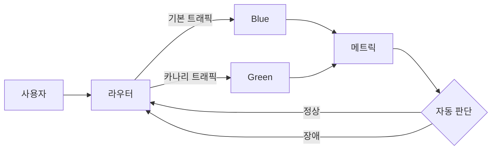

# 블루-그린과 카나리 배포: 실수와 안티패턴 중심

- **블루-그린**은 두 환경을 준비한 뒤 트래픽을 한 번에 전환해 빠르게 롤백한다.
- **카나리**는 일부 트래픽이나 사용자에게 먼저 배포해 위험을 점진적으로 검증한다.
- 배포 전략보다 중요한 것은 **관측성, 데이터 호환성, 자동 롤백 기준**이다.

## 개념 설명

### 블루-그린 배포

현재 운영 중인 환경을 Blue, 새 버전을 Green이라고 한다. Green에 배포와 사전 검증을 완료한 뒤 로드밸런서나 서비스 디스커버리의 대상을 전환한다. 문제가 생기면 다시 Blue로 돌리므로 애플리케이션 롤백은 빠르다.

가장 흔한 실수는 **Green이 실제 운영 트래픽과 다른 조건에서만 정상 동작한다고 착각하는 것**이다. 캐시, 외부 API 권한, 환경 변수, TLS 인증서, 워커 프로세스까지 점검해야 한다. 또한 데이터베이스 스키마를 먼저 삭제하거나 컬럼 타입을 변경하면 애플리케이션만 이전 버전으로 되돌려도 복구되지 않는다. 스키마는 구버전과 신버전이 함께 동작하는 **하위 호환 방식**으로 단계적으로 변경해야 한다.

### 카나리 배포

새 버전을 1%, 5%, 25%처럼 일부 트래픽에 노출하고 오류율, 지연 시간, 비즈니스 지표를 비교한다. 단순히 트래픽 비율만 늘리는 것은 안티패턴이다. 특정 지역, 기기, 고객 등으로 트래픽이 편향되면 대표성이 부족하고, 표본이 너무 작으면 드문 장애를 발견하지 못한다.

또한 “에러율이 낮으면 성공”이라고 판단하면 안 된다. HTTP 성공이어도 결제 실패, 가입 전환율 하락, 메시지 중복 같은 문제가 발생할 수 있다. 자동 중단 기준과 단계별 대기 시간을 미리 정의해야 한다.

공통적으로 세션을 로컬 메모리에 저장하거나 캐시 키 형식을 바꾸면 전환 및 혼합 운영 중 사용자가 로그아웃될 수 있다. 세션은 공유 저장소에 두고, 캐시는 구버전·신버전이 함께 읽을 수 있게 설계한다. 롤백은 배포 명령의 역순 실행이 아니라 **트래픽을 안전한 버전으로 되돌리는 작업**이어야 한다.

```yaml
steps:
  - shift: 5%
    wait: 10m
    abort_if: "5xx > 1% or p95 > 500ms"
  - shift: 25%
    wait: 20m
  - shift: 100%
```



## 면접 질문

### 1. 블루-그린과 카나리의 차이는?

블루-그린은 환경 전환과 빠른 롤백에 강하고, 카나리는 점진적 노출로 장애 범위를 줄이고 실제 트래픽에서 검증하는 데 강하다. 대규모 서비스에서는 카나리 후 전체 전환을 조합하기도 한다.

### 2. 데이터베이스 마이그레이션 중 롤백은 어떻게 보장하는가?

`expand → migrate → contract` 단계를 사용한다. 먼저 새 컬럼을 추가하고 양쪽 버전이 읽고 쓰게 만든 뒤 데이터를 이관한다. 모든 구버전이 제거된 후에야 기존 컬럼을 삭제한다.

## 한 줄 정리

배포 전략의 핵심은 전환 방식이 아니라 **구버전 공존, 충분한 지표, 자동 중단과 안전한 롤백**이다.
