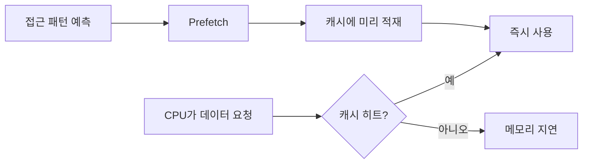

# Prefetching

- **핵심 개념:** 실제 접근 전에 필요한 데이터를 미리 캐시나 메모리로 가져와 접근 지연을 숨긴다.
- **주요 효과:** 캐시 미스와 메모리 대기 시간을 줄여 연속적인 데이터 처리 성능을 높인다.
- **주요 위험:** 잘못 예측하면 메모리 대역폭을 낭비하고 캐시 오염(cache pollution)을 유발한다.

## 개념 설명

Prefetching은 CPU 또는 프로그램이 앞으로 사용할 가능성이 높은 데이터를 실제 요청보다 먼저 가져오는 기법이다. 일반적인 데이터 접근은 `CPU → 캐시 확인 → 캐시 미스 발생 → 메모리 접근` 순서이지만, 프리페칭을 사용하면 메모리 접근 시간을 계산이나 다른 작업과 겹칠 수 있다.

하드웨어 프리페처는 메모리 접근 패턴을 관찰한다. 배열을 순차적으로 읽거나 일정한 간격으로 접근하면 다음 캐시 라인을 자동으로 예측해 L1/L2/L3 캐시에 적재한다. 소프트웨어 프리페칭은 컴파일러나 개발자가 `prefetch` 명령을 삽입해 사용 시점을 직접 지정한다.

프리페칭은 **공간적 지역성**과 **시간적 지역성**을 활용한다. 배열 순회처럼 규칙적인 접근에는 효과적이지만, 연결 리스트나 해시 테이블처럼 주소가 불규칙하면 예측 정확도가 낮다. 또한 너무 이른 프리페치는 데이터가 사용되기 전에 캐시에서 밀려날 수 있고, 너무 늦으면 캐시 미스를 막지 못한다.

성능 개선 여부는 단순히 메모리 접근 횟수가 아니라 다음 요소에 좌우된다.

- 데이터 접근 패턴의 규칙성
- 프리페치 거리(prefetch distance)
- 캐시 크기와 계층 구조
- 메모리 대역폭 및 동시 메모리 요청 수
- 프리페치 정확도와 캐시 오염 정도

실무에서는 먼저 프로파일러로 캐시 미스와 병목을 측정해야 한다. 프리페칭은 메모리 지연이 병목일 때 유효하며, CPU 연산이나 분기 예측이 병목인 경우에는 효과가 제한적이다.

```c
#include <immintrin.h>

void sum_array(const int *a, int n, long *result) {
    long sum = 0;
    for (int i = 0; i < n; i++) {
        if (i + 16 < n)
            _mm_prefetch((const char *)&a[i + 16], _MM_HINT_T0);
        sum += a[i];
    }
    *result = sum;
}
```



## 면접 질문

### 1. 프리페칭과 캐시의 차이는 무엇인가요?

캐시는 자주 사용한 데이터를 저장해 재사용하는 저장 공간이고, 프리페칭은 미래에 사용할 데이터를 예측해 캐시에 미리 가져오는 동작이다. 캐시는 저장 정책 중심이고, 프리페칭은 예측과 적재 시점 중심이다.

### 2. 프리페칭이 항상 성능을 향상시키지 못하는 이유는 무엇인가요?

예측이 틀리면 불필요한 메모리 대역폭을 사용하고 유용한 데이터를 캐시에서 밀어낼 수 있다. 또한 데이터가 불규칙하게 접근되거나 프리페치 시점이 너무 빠르거나 늦으면 지연 시간을 숨기지 못한다.

> **한 줄 정리:** 프리페칭은 예측 가능한 메모리 접근을 미리 수행해 캐시 미스를 숨기지만, 정확도와 대역폭을 함께 고려해야 한다.
