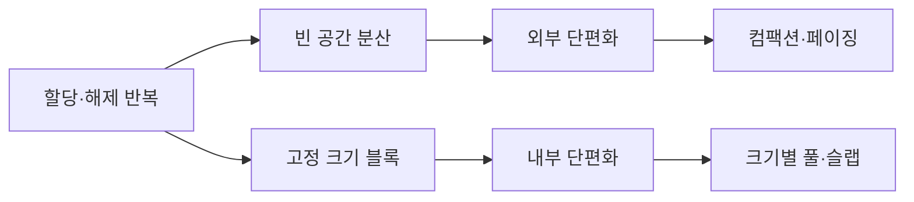

# 메모리 단편화

- **외부 단편화**: 여유 메모리가 여러 작은 조각으로 흩어져 큰 연속 영역을 할당하지 못하는 현상
- **내부 단편화**: 할당한 블록 내부에서 실제 사용하지 않는 공간이 발생하는 현상
- 해결 방법은 **컴팩션, 적절한 할당기, 페이징, 풀(pool)·슬랩 할당** 등이며 상황에 따라 선택한다

## 개념 설명

메모리 단편화는 사용 가능한 총 메모리는 충분하지만, 배치 방식 때문에 효율적으로 사용하지 못하는 문제다. 주로 동적 메모리 할당과 해제가 반복될 때 발생한다.

**외부 단편화**는 할당 가능한 공간이 여러 비연속 조각으로 나뉘는 경우다. 예를 들어 10MB, 20MB, 15MB의 빈 공간이 있어도 각각 떨어져 있다면 40MB의 연속 공간을 요구하는 요청은 실패할 수 있다. 대표적인 해결책은 사용 중인 블록을 한쪽으로 이동시키는 **컴팩션(compaction)** 이지만, 데이터 이동 비용과 포인터 수정 문제가 발생한다. 페이징은 물리 메모리를 고정 크기 프레임으로 관리해 외부 단편화를 줄인다.

**내부 단편화**는 할당 단위가 요청 크기보다 커서 생긴다. 17바이트를 32바이트 블록에 저장하면 15바이트가 낭비된다. 고정 크기 블록을 사용하는 메모리 풀, 페이지, 슬랩 할당기에서 흔하다. 블록 크기를 다양하게 만들면 줄일 수 있지만 관리 복잡도가 증가한다.

면접에서는 “단편화가 메모리 누수와 같은가?”를 구분해야 한다. 메모리 누수는 더 이상 사용하지 않는 메모리를 회수하지 못하는 문제이고, 단편화는 회수 가능한 공간이 있어도 배치·크기 때문에 활용이 비효율적인 문제다. 또한 `first-fit`, `best-fit`, `worst-fit` 같은 할당 전략은 외부 단편화와 탐색 비용 사이의 절충점이다. 현대 할당기는 스레드별 캐시, 크기별 프리 리스트, 페이지 단위 관리 등을 함께 사용한다.

```c
// 외부 단편화의 개념적 예시
char *a = malloc(100);
char *b = malloc(100);
char *c = malloc(100);
free(b);                 // 중간에 작은 빈 공간 발생
char *large = malloc(180); // 총 여유 공간이 있어도 실패 가능
```



## 면접 질문

### 1. 외부 단편화와 내부 단편화의 차이는 무엇인가요?

외부 단편화는 빈 공간이 여러 비연속 영역으로 흩어지는 문제이고, 내부 단편화는 할당된 영역 내부의 남는 공간 문제다. 전자는 연속 할당에서 중요하고, 후자는 고정 크기 할당에서 자주 발생한다.

### 2. 페이징은 단편화를 어떻게 해결하나요?

가상 메모리를 고정 크기 페이지, 물리 메모리를 프레임으로 나눠 비연속 배치를 허용하므로 외부 단편화를 크게 줄인다. 대신 마지막 페이지의 미사용 영역 등 내부 단편화는 남을 수 있다.

> **한 줄 요약:** 메모리 단편화는 “공간의 총량”보다 “공간이 어떤 크기와 위치로 나뉘어 있는가”의 문제다.
