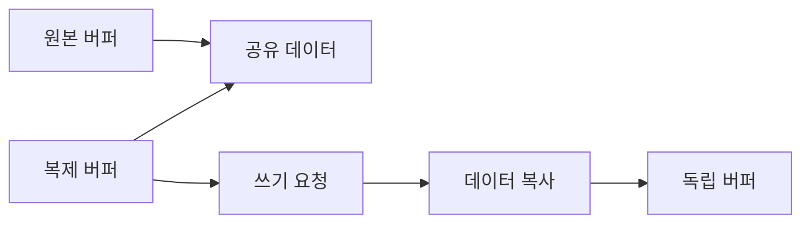

# Copy-on-Write(COW): 복사 비용을 늦추는 성능 최적화

- **핵심 아이디어:** 데이터를 즉시 복사하지 않고 여러 객체가 같은 메모리를 공유하다가, 수정이 발생할 때만 복사한다.
- **성능 효과:** 읽기·복제 중심 작업에서는 메모리 사용량과 복사 시간을 줄이지만, 첫 쓰기 시 지연과 추가 메모리 비용이 발생한다.
- **주의점:** 공유 상태의 추적, 동시성 제어, 페이지 단위 복사 비용 때문에 모든 상황에서 빠른 것은 아니다.

## 개념 설명

일반적인 깊은 복사는 객체를 복제하는 순간 전체 데이터를 복사한다. 데이터가 크거나 복제 직후 읽기만 한다면 실제로 필요하지 않은 복사 비용이 발생한다. COW는 복제본과 원본이 우선 같은 저장 공간을 참조하고, 데이터가 변경되는 순간 독립적인 공간을 확보한다.

운영체제의 `fork()`가 대표적인 예다. 프로세스 생성 직후 부모와 자식은 물리 메모리 페이지를 공유하고, 쓰기가 발생한 페이지에 대해서만 페이지 폴트 후 복사한다. 따라서 큰 프로세스를 빠르게 복제할 수 있다. 단, 자식이 많은 페이지를 수정하면 결국 대부분 복사되어 초기 절약 효과가 사라진다.

성능 최적화 관점에서는 **읽기 비율이 높고, 복제 후 수정 범위가 작으며, 데이터가 큰 경우** 특히 유리하다. 반대로 복제 직후 전체 데이터를 변경하거나 쓰기가 매우 빈번하면 매번 복사·동기화 비용이 발생해 일반적인 이동(move), 가변 버퍼 재사용, 구조적 공유 자료구조가 더 적합할 수 있다.

COW 구현은 참조 카운트, 쓰기 전용 잠금, 변경 감지 등의 관리 비용도 가진다. 멀티스레드 환경에서는 한 스레드의 쓰기가 다른 스레드의 읽기 성능이나 메모리 사용량에 영향을 줄 수 있다. 또한 얕은 복사와 COW를 혼동하면 원본까지 변경되는 버그가 발생하므로 API의 복사 의미를 명확히 해야 한다.

```python
class CowBuffer:
    def __init__(self, data, shared=False):
        self._data = data
        self._shared = shared

    def clone(self):
        return CowBuffer(self._data, shared=True)

    def set(self, i, value):
        if self._shared:          # 첫 쓰기 때만 실제 복사
            self._data = self._data.copy()
            self._shared = False
        self._data[i] = value

a = CowBuffer([0] * 1_000_000)
b = a.clone()                     # 큰 배열을 즉시 복사하지 않음
b.set(0, 1)                       # 이 시점에 배열 복사
```



## 면접 질문

### 1. COW는 언제 효과적인가?

복제 후 읽기 비율이 높고, 실제 수정 범위가 작으며, 원본 데이터가 큰 경우 효과적이다. 반대로 복제 직후 전체를 수정하면 일반 복사와 차이가 작다.

### 2. COW의 단점은 무엇인가?

첫 쓰기 시 예기치 않은 지연과 메모리 급증이 발생할 수 있다. 참조 상태 관리와 동시성 제어도 필요하며, 쓰기 패턴이 많으면 성능 이점이 사라진다.

> **한 줄 정리:** Copy-on-Write는 “복사하지 않는 것”이 아니라 “실제로 수정될 때까지 복사를 지연하는 것”이다.
