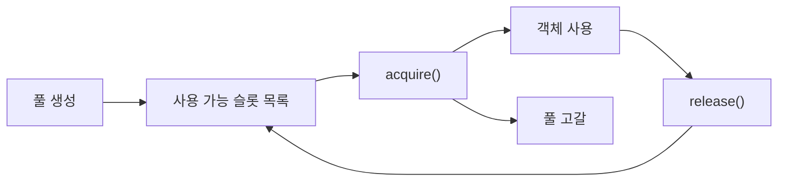

# 메모리 풀링(Memory Pooling)과 성능 최적화

- 객체를 매번 할당·해제하지 않고 미리 확보한 메모리를 재사용해 할당 비용과 단편화를 줄인다.
- 고정 크기 객체, 높은 생성·소멸 빈도, 지연시간 민감한 서버·게임·임베디드 시스템에 특히 효과적이다.
- 풀 크기, 객체 수명, 스레드 경쟁을 잘못 설계하면 메모리 낭비·캐시 손실·동시성 병목이 발생한다.

## 개념 설명

메모리 풀은 큰 메모리 영역을 한 번 확보한 뒤, 이를 여러 개의 슬롯으로 나누어 객체를 제공하는 기법이다. 일반적인 동적 할당은 `malloc/new` 호출마다 할당기 메타데이터 처리, 락 획득, 시스템 호출 가능성이 발생한다. 반면 풀은 사용 가능한 슬롯의 목록에서 하나를 꺼내고, 반환 시 다시 목록에 넣으므로 작업이 단순하다.

성능상 핵심 이점은 **할당 지연시간의 예측 가능성**과 **할당기 호출 감소**다. 객체 크기가 동일하면 free list를 사용해 보통 O(1)에 할당·반환할 수 있다. 연속적인 메모리 배치는 캐시 지역성도 개선할 수 있으며, 반복적인 생성·삭제에 따른 외부 단편화를 줄인다.

다만 모든 상황에 적합하지는 않다. 객체 크기나 수명이 매우 다양하면 내부 단편화가 커질 수 있고, 풀에 반환하지 못한 객체는 메모리 누수처럼 남는다. 멀티스레드 환경에서는 전역 풀 하나에 락을 두기보다 스레드별 로컬 풀, thread cache, 배치 반환을 고려한다. 객체가 풀의 수명을 넘어 참조되지 않는지 반드시 보장해야 한다. 실무에서는 평균 처리량뿐 아니라 p99 지연시간, 캐시 미스, 락 경합, 메모리 사용량을 함께 측정한다.

## 코드 예시: 고정 크기 객체 풀

```cpp
#include <vector>
#include <cstddef>

class IntPool {
    std::vector<int> storage, free_list;
public:
    explicit IntPool(size_t n) : storage(n), free_list(n) {
        for (size_t i = 0; i < n; ++i) free_list[i] = n - 1 - i;
    }
    int* acquire() {
        if (free_list.empty()) return nullptr;
        return &storage[free_list.back()];
    }
    void release(int* p) {
        free_list.push_back(static_cast<size_t>(p - storage.data()));
    }
};
```

실제 구현에서는 `acquire()`에서 free list의 인덱스를 제거하고, `release()`에서 중복 반환을 검증해야 한다. 객체 생성자·소멸자가 필요한 경우 슬롯과 생명주기를 분리해 placement new와 명시적 소멸자를 사용한다.

## 동작 흐름



## 면접 질문

### 1. 메모리 풀은 일반 동적 할당보다 언제 유리한가?

동일한 크기의 객체를 반복적으로 빠르게 할당·해제하고, 지연시간 변동을 줄여야 할 때 유리하다. 반대로 객체 크기와 수명이 다양하거나 사용량이 예측 불가능하면 일반 할당기나 전문 allocator가 더 적합할 수 있다.

### 2. 멀티스레드 메모리 풀의 병목을 어떻게 줄이는가?

전역 락 대신 스레드별 로컬 풀을 사용하고, 부족할 때만 중앙 풀에서 큰 블록을 가져온다. 반환도 배치 처리하면 락 획득 횟수와 캐시 라인 경합을 줄일 수 있다.

## 한 줄 정리

메모리 풀링은 반복 할당의 비용과 지연시간 변동을 줄이는 최적화지만, 풀 크기·수명·동시성을 측정 기반으로 설계해야 한다.
