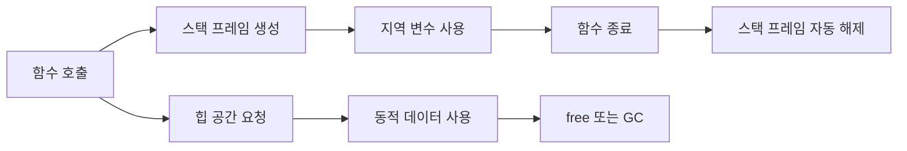

# 스택 vs 힙 할당

- **스택**: 함수 호출과 함께 자동으로 확보되고, 함수가 끝나면 자동으로 해제된다.
- **힙**: 실행 중 원하는 크기로 확보하며, 해제 시점을 직접 관리하거나 GC가 관리한다.
- **핵심 차이**: 스택은 빠르고 수명이 짧으며, 힙은 유연하지만 관리 비용과 오류 가능성이 더 크다.

## 개념 설명

메모리를 책상에 비유해 보자. **스택은 책상 위에 쌓는 서류 더미**다. 가장 나중에 올린 서류를 가장 먼저 치우는 방식인 LIFO를 따른다. 함수가 호출되면 매개변수, 지역 변수, 반환 주소 등을 담은 공간이 쌓이고, 함수가 끝나면 그 공간 전체가 한 번에 사라진다. 구조가 단순해 할당과 해제가 매우 빠르지만, 크기가 제한적이고 오래 보관하기 어렵다. 재귀 호출이 너무 깊거나 큰 지역 배열을 만들면 스택 오버플로가 발생한다.

**힙은 창고**에 가깝다. 필요한 시점에 원하는 크기의 공간을 찾아 물건을 보관할 수 있으므로 동적으로 크기가 바뀌거나 함수가 끝난 뒤에도 살아 있어야 하는 데이터를 저장하기 적합하다. 대신 빈 공간을 찾고 관리하는 비용이 있으며, C/C++에서는 직접 해제해야 한다. 해제를 잊으면 메모리 누수, 이미 해제한 공간을 사용하면 댕글링 포인터가 발생한다. 조각화로 인해 전체 여유 공간은 충분해도 큰 연속 공간을 얻지 못할 수도 있다.

실제 배치는 언어와 컴파일러에 따라 달라진다. 예를 들어 Java 객체는 일반적으로 힙에 있지만, JVM이 객체가 함수 밖으로 나가지 않는다고 판단하면 최적화할 수 있다. 따라서 “지역 변수는 무조건 스택”이라고 외우기보다 **수명, 크기, 소유권, 언어의 메모리 관리 방식**을 함께 봐야 한다.

## 코드 예시

```c
#include <stdlib.h>

void example(void) {
    int count = 10;                 // 스택: 함수 종료 시 자동 해제
    int *data = malloc(10 * sizeof(int)); // 힙: 실행 중 할당

    if (data != NULL) {
        data[0] = count;
        free(data);                 // C에서는 직접 해제
        data = NULL;                // 해제된 주소 재사용 방지
    }
}
```

## 흐름 비교



## 면접 질문

### 1. 스택이 힙보다 빠른 이유는?

스택은 마지막에 할당한 공간을 순서대로 되돌리므로 포인터 이동만으로 관리할 수 있다. 반면 힙은 적절한 빈 공간 탐색, 메타데이터 관리, 경우에 따라 GC가 필요하다. 또한 스택은 메모리 접근 패턴이 단순해 캐시 효율도 좋은 편이다.

### 2. 스택에 저장된 변수의 주소를 반환하면 왜 위험한가?

함수가 끝나면 해당 스택 프레임이 사라진다. 따라서 반환된 주소는 유효하지 않은 메모리를 가리키며, 이를 사용하면 정의되지 않은 동작이 발생한다. 오래 살아야 하는 데이터는 힙이나 호출자 소유의 영역에 둬야 한다.

> **한 줄 정리:** 스택은 짧은 수명의 빠른 임시 공간이고, 힙은 오래 유지하거나 크기를 동적으로 관리할 데이터를 위한 공간이다.
