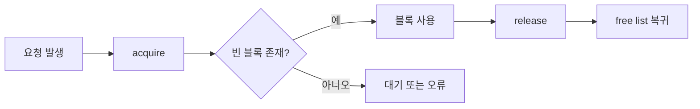

# 메모리 풀링(Memory Pooling)

- 반복적으로 생성·해제되는 객체를 미리 확보해 재사용하여 할당 비용과 메모리 단편화를 줄인다.
- 성능 향상보다 **수명 관리, 풀 고갈, 반환 누락, 동시성**이 실무 장애의 핵심 원인이다.
- 풀 크기와 객체 수명을 잘못 정하면 메모리 절약이 아니라 메모리 고정 점유와 지연 급증으로 이어진다.

## 개념 설명

메모리 풀은 동일하거나 유사한 크기의 메모리 블록을 한 번에 확보한 뒤, 애플리케이션 요청에 따라 빌려주고 반납하는 방식이다. `malloc/free`, `new/delete`를 매번 호출하는 대신 자유 목록(free list)을 관리한다. 네트워크 버퍼, 게임 엔티티, 데이터베이스 커넥션, 스레드 객체처럼 생성·삭제가 빈번하고 크기가 일정한 대상에 특히 적합하다.

일반적인 흐름은 `acquire`에서 빈 블록을 꺼내고, 사용 후 반드시 `release`로 되돌리는 것이다. 반납된 블록은 초기화하지 않으면 이전 요청의 데이터가 남을 수 있으므로 보안 정보나 상태 필드를 명시적으로 초기화해야 한다.

실무 트러블슈팅에서는 먼저 풀 고갈 여부를 확인한다. 고갈 시 대기, 일반 힙으로의 fallback, 오류 반환 중 어떤 정책인지에 따라 장애 양상이 달라진다. 대기 시간이 길어지면 요청 지연과 스레드 적체가 발생하고, fallback은 성능 저하와 메모리 사용량 증가를 숨길 수 있다. `in-use`, `capacity`, `wait time`, `allocation failure`, `release count`를 지표로 기록하자.

반환 누락은 사용 중인 블록 수가 계속 증가하는 형태로 나타난다. 요청 ID나 소유자 태그를 기록하고, 타임아웃·예외 경로에서도 자동 반납되도록 RAII 또는 `defer` 패턴을 사용한다. 이중 반납과 다른 풀에 반납하는 오류는 free list 손상으로 이어질 수 있으므로 디버그 모드에서 상태 값과 canary를 검증한다.

멀티스레드 환경에서는 전역 락 하나가 병목이 될 수 있다. 스레드별 로컬 풀을 우선 사용하고, 부족할 때만 중앙 풀에서 가져오는 구조가 효과적이다. 다만 로컬 풀은 메모리가 특정 스레드에 편중될 수 있으므로 최대 보유량과 주기적 회수 정책이 필요하다. 풀 크기는 평균값이 아니라 피크 동시 사용량, 허용 지연, 메모리 예산을 기준으로 정한다.

## 코드 예시

```cpp
class Pool {
    struct Node { Node* next; };
    std::vector<std::byte> storage;
    Node* free_list = nullptr;
public:
    explicit Pool(size_t n) : storage(n * sizeof(Node)) {
        for (size_t i = 0; i < n; ++i) {
            auto* p = reinterpret_cast<Node*>(storage.data() + i * sizeof(Node));
            p->next = free_list; free_list = p;
        }
    }
    void* acquire() {
        if (!free_list) throw std::bad_alloc(); // 고갈 정책
        Node* p = free_list; free_list = p->next; return p;
    }
    void release(void* p) {
        auto* n = static_cast<Node*>(p);
        n->next = free_list; free_list = n;
    }
};
```

## 동작 흐름



## 면접 질문

### 1. 메모리 풀링이 항상 성능을 개선하나요?

아니다. 객체 크기가 다양하거나 사용 빈도가 낮으면 내부 단편화와 고정 점유 메모리가 커질 수 있다. 실제 할당 프로파일과 지연 측정을 기준으로 적용해야 한다.

### 2. 메모리 풀 고갈과 메모리 누수를 어떻게 구분하나요?

고갈은 현재 사용량이 풀 용량에 도달한 상태이고, 누수는 반납되지 않은 사용량이 시간에 따라 계속 증가하는 상태다. `in-use` 추이, 반납 횟수, 요청별 소유 정보를 함께 확인한다.

## 한 줄 정리

메모리 풀링은 할당 비용을 줄이는 기법이지만, 운영에서는 **고갈·누수·동시성·반납 검증을 관측하고 통제하는 설계**가 핵심이다.
