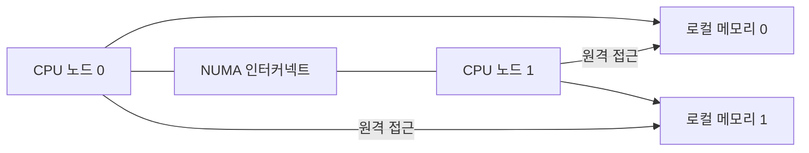

# NUMA 아키텍처

- **NUMA(Non-Uniform Memory Access)**는 모든 CPU가 메모리에 같은 비용으로 접근하지 않는 구조다.
- CPU와 가까운 **로컬 메모리**는 빠르고, 다른 CPU에 연결된 **원격 메모리**는 상대적으로 느리다.
- 성능을 높이려면 스레드와 데이터를 같은 NUMA 노드에 배치하는 것이 중요하다.

## 개념 설명

NUMA를 아파트 단지에 비유할 수 있다. 여러 동에 CPU와 메모리가 함께 있고, 각 동의 주민은 자기 동의 창고를 가장 빠르게 이용한다. 다른 동의 창고도 사용할 수 있지만, 이동 시간이 추가된다.

전통적인 UMA에서는 모든 CPU가 하나의 메모리를 비슷한 비용으로 사용한다. 반면 NUMA 시스템은 여러 **NUMA 노드**로 구성된다. 각 노드는 CPU 코어, 캐시, 로컬 메모리를 포함하며, 노드 사이에는 고속 인터커넥트가 연결된다.

예를 들어 노드 0에서 실행 중인 스레드가 노드 0의 메모리를 읽으면 로컬 접근이다. 노드 1의 메모리를 읽으면 원격 접근이 된다. 원격 접근은 지연 시간이 길고 인터커넥트 대역폭도 공유하므로, 대규모 서버에서 성능 차이가 커질 수 있다.

운영체제는 스케줄링과 메모리 할당 시 NUMA 위치를 고려한다. 일반적으로 스레드가 실행되는 노드에서 메모리를 할당하는 **First Touch** 정책이 사용된다. 따라서 한 스레드가 초기화한 배열을 다른 노드의 여러 스레드가 처리하면 원격 메모리 접근이 늘어날 수 있다.

실무에서는 데이터베이스, JVM, 컨테이너, 멀티스레드 애플리케이션의 CPU·메모리 바인딩을 점검한다. Linux에서는 `numactl`, `lscpu -e`, `numastat` 등으로 노드 구성과 원격 접근 통계를 확인할 수 있다. 단, NUMA 최적화는 메모리 용량보다 접근 지역성과 부하 균형이 핵심이다. 한 노드에 작업을 몰아넣으면 로컬 접근이어도 병목이 발생한다.

## 면접 질문

### 1. NUMA에서 원격 메모리 접근이 느린 이유는?

CPU가 다른 노드의 메모리에 접근하려면 노드 간 인터커넥트를 거쳐야 한다. 이 과정에서 추가 지연이 발생하고, 여러 CPU가 링크 대역폭을 공유한다.

### 2. NUMA 환경에서 성능을 개선하는 방법은?

스레드와 데이터를 같은 노드에 배치하고, 데이터 초기화를 처리 스레드가 수행하도록 한다. 필요하면 CPU·메모리 affinity를 설정하되, 특정 노드에 부하가 집중되지 않게 균형도 확인한다.

## 한 줄 정리

**NUMA는 메모리 위치에 따라 접근 비용이 달라지므로, CPU·스레드·데이터의 지역성을 관리해야 성능을 얻는 아키텍처다.**
