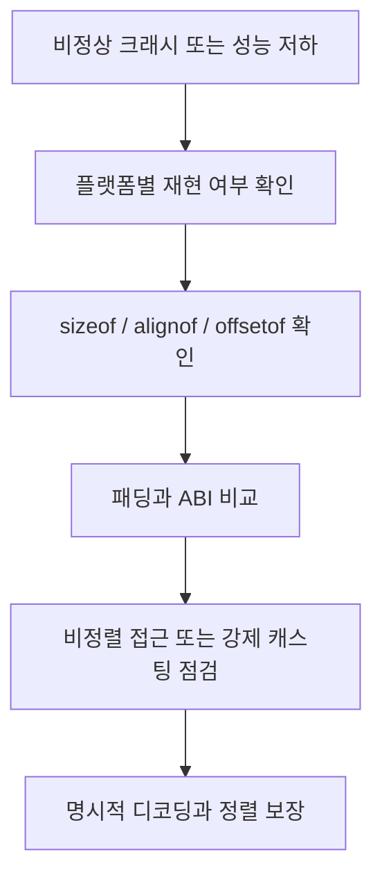

# 메모리 정렬(Memory Alignment)과 실무 트러블슈팅

- **정렬**은 데이터의 시작 주소를 타입이 요구하는 배수에 맞추는 규칙이다. `int`가 4바이트 정렬을 요구하면 주소가 `0x1000`, `0x1004`처럼 배치된다.
- 구조체에는 정렬을 맞추기 위한 **패딩(padding)** 이 삽입될 수 있어 `sizeof(struct)`가 멤버 크기의 합보다 커진다.
- 잘못된 정렬은 성능 저하뿐 아니라 일부 아키텍처의 `SIGBUS`, ABI 불일치, 바이너리 프로토콜 파싱 오류로 이어진다.

## 개념 설명

CPU는 메모리를 바이트 단위로 다루지만, 여러 바이트 데이터를 한 번에 읽을 때 특정 주소 경계를 선호하거나 요구한다. 이를 메모리 정렬이라고 한다. 예를 들어 8바이트 정수는 일반적으로 8의 배수 주소에 놓인다. x86은 비정렬 접근을 대부분 허용하지만 여러 번의 메모리 접근이 필요해 느려질 수 있다. ARM 일부 환경처럼 비정렬 접근을 제한하는 CPU에서는 예외가 발생할 수 있다.

구조체는 각 멤버의 정렬 조건을 만족하도록 중간에 패딩을 넣는다. 또한 배열에서 다음 원소도 정렬되어야 하므로 구조체 끝에도 꼬리 패딩이 추가될 수 있다. 멤버를 큰 정렬 요구량부터 배치하면 전체 크기를 줄일 가능성이 높다. 단, 크기 최적화보다 ABI 호환성과 가독성이 우선인 경우도 있다.

실무에서는 `memcpy`로 받은 네트워크 패킷이나 파일 데이터를 구조체 포인터로 강제 변환하는 코드가 자주 문제를 만든다. 패딩, 엔디언, 컴파일러 옵션이 서로 다르면 필드 위치가 달라진다. `#pragma pack`이나 `__attribute__((packed))`는 패딩을 제거하지만 비정렬 접근과 성능 저하를 유발할 수 있으므로 외부 포맷을 표현할 때만 제한적으로 사용한다. 보통은 바이트 배열에서 필드를 명시적으로 디코딩하는 편이 안전하다.

트러블슈팅 시에는 `sizeof`, `_Alignof` 또는 `alignof`, `offsetof`를 확인하고, 컴파일러의 구조체 레이아웃 옵션과 플랫폼을 비교한다. AddressSanitizer는 주로 범위 오류를 찾고, UBSan은 일부 정렬 위반을 탐지한다. 크래시 주소가 특정 멤버 접근 직후인지, x86에서는 재현되지 않고 ARM에서만 발생하는지도 중요한 단서다.

```c
#include <stdio.h>
#include <stddef.h>
#include <stdalign.h>

struct Bad { char flag; int count; short code; };
struct Good { int count; short code; char flag; };

int main(void) {
    printf("Bad:  %zu, count=%zu\n",
           sizeof(struct Bad), offsetof(struct Bad, count));
    printf("Good: %zu, count=%zu\n",
           sizeof(struct Good), offsetof(struct Good, count));
    printf("alignof(int)=%zu\n", alignof(int));
}
```



## 인터뷰 질문

1. **구조체 멤버 순서를 바꾸면 왜 크기가 줄어들 수 있나요?**  
   정렬 요구량이 큰 멤버를 앞에 배치하면 중간 패딩이 감소하기 때문이다. 단, 외부 ABI나 바이너리 포맷은 임의로 변경하면 안 된다.

2. **`packed` 구조체를 항상 사용하면 안 되는 이유는 무엇인가요?**  
   패딩은 제거되지만 멤버 주소가 비정렬이 될 수 있다. CPU 예외, 성능 저하, 직접 메모리 접근 문제를 만들 수 있으므로 직렬화 경계에서만 신중하게 사용한다.

> **한 줄 정리:** 메모리 정렬은 구조체 크기 문제가 아니라 CPU 접근, ABI 호환성, 데이터 포맷 안정성을 좌우하는 실행 환경의 계약이다.
